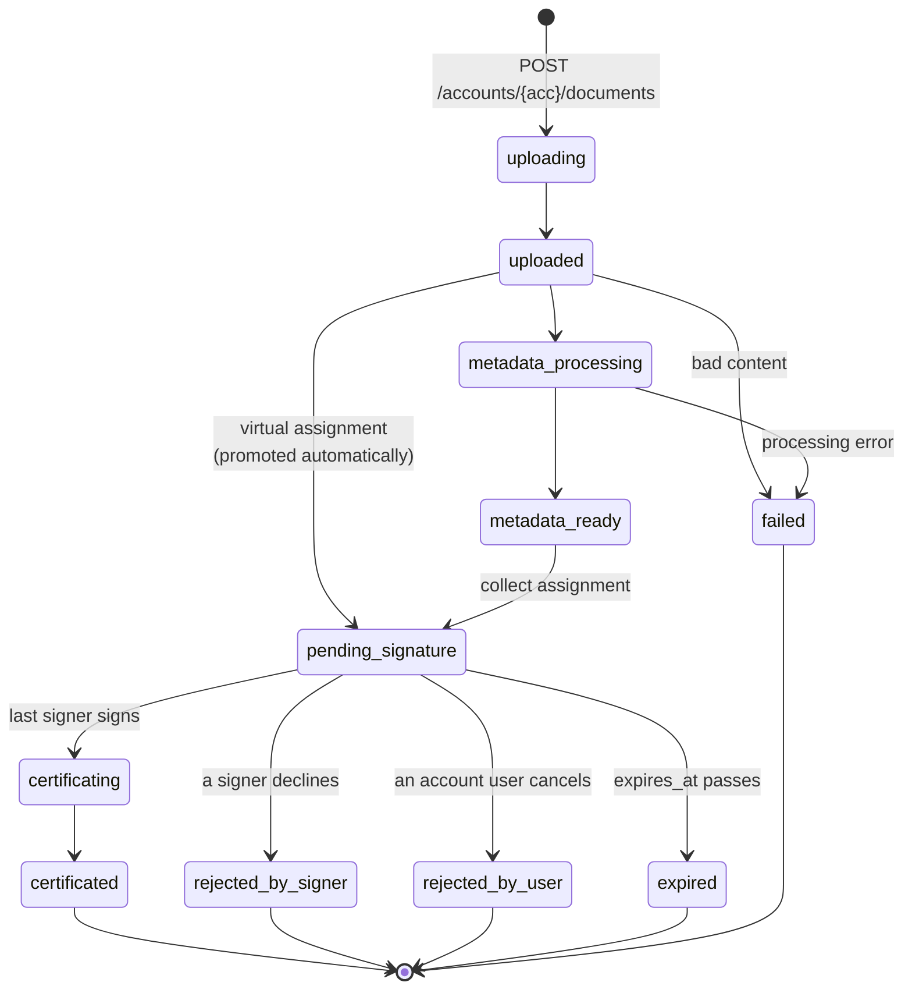

# Assinafy for WordPress

*[Leia em português](README.md) · English*

Send a PDF from WordPress for electronic signature with [Assinafy](https://www.assinafy.com.br/),
and track it from upload to signed artifact without leaving the admin.

This document describes the current plugin source and its integration contract. API payloads
are illustrative examples with placeholder identities and credentials; balances, prices,
timings and available account features must be read from the configured account.

- [1. What this plugin does](#1-what-this-plugin-does)
- [2. Requirements and installation](#2-requirements-and-installation)
- [3. Configuration](#3-configuration)
- [4. The document flow, step by step](#4-the-document-flow-step-by-step)
- [5. Extension points](#5-extension-points)
- [6. WP-CLI](#6-wp-cli)
- [7. Webhooks](#7-webhooks)
- [8. WooCommerce](#8-woocommerce)
- [9. SDK call reference](#9-sdk-call-reference)
- [10. Troubleshooting](#10-troubleshooting)
- [11. Development](#11-development)
- [Multisite and privacy behavior](#multisite-and-privacy-behavior)

---

Detailed verification results, fixes and coverage limits are in `AUDIT.md` in the source
checkout. That internal audit report is excluded from release ZIPs.
The core/adapter contract and integration rollout are in [docs/integrations.en.md](docs/integrations.en.md).

## 1. What this plugin does

It uploads a PDF to an Assinafy account, asks named people to sign it, mirrors the remote
state into a WordPress custom post type, and serves the finished artifacts back through a
capability-gated proxy. Everything else in the plugin — the settings screen, the webhook
receiver, the reconcile cron, WP-CLI, WooCommerce — exists to make that one path reliable.

Core owns sending, recovery, storage, webhooks and synchronization. Host-specific behavior
belongs in adapters. WooCommerce and Elementor Forms ship as bundled adapters.
Gravity Forms, Contact Form 7 and WPForms have separate development add-ons in the source
checkout under `addons/`, version 0.1.0. Each sends an existing PDF with mapped signer
name/email through core. CF7 and WPForms Lite are tested against real free host plugins;
Gravity Forms and Elementor Pro have documented API contract tests only, pending licensed
installation validation. WPForms Pro entry linkage is also unverified on a licensed host. A separate WooCommerce product follows only after its
contract workflow is defined. See [the adapter guide](docs/integrations.en.md#rollout) and [Elementor setup](docs/elementor.en.md).

### Form adapters

| Adapter | Installation | Trigger and recovery | Verification limit |
| --- | --- | --- | --- |
| Gravity Forms | Separate `assinafy-gravity-forms` add-on | Native background feed; conditional rules; one entry/feed identity; entry-page retry | Requires Gravity Forms 2.9.4+; documented host doubles only |
| Contact Form 7 | Separate `assinafy-contact-form-7` add-on | Successful accepted mail result with configured consent; core receipt and protected retry | Real CF7 6.1.7 |
| WPForms | Separate `assinafy-wpforms` add-on | Successful processing; core receipt even without Lite entry storage; protected retry | Real WPForms Lite 2.0.1.1; Pro not runtime verified |
| Elementor Forms | Included in core; add the Assinafy action | Native form action, same-record callback dedupe; core recovery error details | Elementor Pro required; documented host doubles only; no form retry UI |

These are initial PDF-send workflows. They do not generate contracts, merge form values into
PDFs, require payment, or gate fulfillment on a signature. Configure consent in the host.
CF7 and WPForms retain the minimum retry configuration on the core document, not the full
submission. Distinct accepted entryless submissions are distinct requests, even with identical
values; callback retries reuse the receipt. Privacy erasure blocks resending erased contacts.
The core document screen remains the shared place for status, signing links and downloads.

Build core with `bin/build-zip.sh`, then run `bin/build-addons.sh` to create the three separate
ZIPs under `dist/addons/`. Core's ZIP excludes `addons/`; install only the add-on for the form
plugin you use. Each add-on directory includes its own setup README and `readme.txt`. These
artifacts are development builds, not published WordPress.org releases. Official Plugin Check
reports no errors; add-ons still have directory-review warnings because the required core is
unlisted, and the WPForms name/slug is flagged. Those warnings and licensed-host validation
remain release gates.

### The domain model

Assinafy has **no envelope**. The object graph is flat, and understanding its five nouns is
most of what you need:

| Entity | Scope | Identity | What it is |
|---|---|---|---|
| **Account** | workspace | `{ACCOUNT_ID}` | Account collections use `accounts/{accountId}/…`; individual document operations use `documents/{documentId}/…`. |
| **Document** | account | opaque hex string | The PDF and its lifecycle. Carries `artifacts`, `pages[]`, `tags[]`, and an embedded `assignment`. |
| **Signer** | account | opaque hex string | A reusable person record. **`email` is unique per account.** |
| **Assignment** | document, 1:1, permanent | opaque hex string | The signature request itself. One per document, forever. There is no update route. |
| **Artifact** | document | a name, not an id | A downloadable file derived from the document: `original`, `certificated`, `certificate-page`, `pades`, `bundle`. |

Ids are **opaque variable-length hex strings** — 26 to 28 characters observed in one account.
Store them as strings. Never validate with a fixed-length regex.

Three consequences fall straight out of the model and shape the whole plugin:

1. **An assignment cannot be edited.** Changing a signer, a message or a method means
   uploading the document again. The plugin offers resend, extend and cancel — the three
   post-send operations the API actually has — and nothing that pretends to be an edit.
2. **A signer is identified by email, account-wide.** Sending to the same person twice must
   look the signer up before creating one, or the second send fails.
3. **Artifact endpoints require account authentication.** The plugin stores artifact names
   and uses [`DownloadProxy`](src/Documents/DownloadProxy.php) to fetch their bytes server-side
   with the active credential. Browser download links point to the permission-checked WordPress proxy.

### The state machine

A document moves through exactly eleven statuses. `is_closed: true` marks every terminal
one — drive "is this finished?" from that flag, not from a hand-maintained list.



| Code | Deletable | Meaning |
|---|---|---|
| `uploading` | no | Transient, rarely observed. |
| `uploaded` | no | Bytes accepted. `pages: []`. A **virtual** assignment may already exist. |
| `metadata_processing` | no | Pages rendering. `pages[]` fills in during this state. |
| `metadata_ready` | **yes** | Pages rendered, thumbnail available. |
| `pending_signature` | **yes** | Signers notified. Deleting is the only cancel the API offers. |
| `certificating` | no | Last signer signed; the platform is sealing the PDF. |
| `certificated` | no | Terminal success; marked not deletable in the current status catalogue. |
| `rejected_by_signer` | **yes** | A signer declined. Terminal. |
| `rejected_by_user` | **yes** | An account user cancelled. Terminal. |
| `expired` | **yes** | `expires_at` passed. Terminal. |
| `failed` | **yes** | Content rejected or processing failed. Terminal. |

There is **no `ready` status**. `document_ready` — the webhook event — means "the last signer
signed", not a status of that name.

The plugin creates a virtual assignment after upload without polling for `metadata_ready`.
Subsequent API responses and reconciliation supply the document's processing/signing status.

### Verification and notification methods

The plugin supports three verification methods and one notification channel per signer.
Values are PascalCase; incompatible method/channel combinations are rejected locally.

| `verification_method` | `notification_methods` | Cost | Requires |
|---|---|---|---|
| `Email` | `["Email"]` | Account estimate | Email, or an existing signer ID |
| `Whatsapp` | `["Whatsapp"]` | Account estimate; plan restrictions may apply | Phone number, or an existing signer ID |
| `DigitalCertificate` | `["Email"]` or `["Whatsapp"]` | Account estimate; feature must be enabled | Existing signer ID with government ID configured in Assinafy; signer alone in its step |

[`Signers`](src/Documents/Signers.php) validates the pairing. Omitting the method and channel
defaults to `Email` when an email is present or no phone is supplied, and otherwise to
`Whatsapp`. Supported explicit channels are preserved.

These three are the whole verification vocabulary. The plugin offers no method the API does
not implement.

---

## 2. Requirements and installation

| | Minimum | Why |
|---|---|---|
| PHP | **8.2** | `assinafy/php-sdk` requires `^8.2`. The bootstrap shows an admin notice and returns on anything older rather than fatalling. |
| WordPress | **6.8** | The release that extended just-in-time translation loading to all plugins. Translations are served as wordpress.org language packs and load from `WP_LANG_DIR` without the plugin asking, so there is no `load_plugin_textdomain()` call and no compiled catalogue in the package. |
| Tested to | 7.1 | |
| Extensions | `sodium`, `mbstring` | Credential encryption and SDK Unicode handling; JSON is built into supported PHP versions. |
| TLS | **1.2** | The plugin requires TLS 1.2 or newer on its own Assinafy requests: 1.2 or 1.3 through WordPress's cURL transport, and exactly 1.2 through the streams transport used without cURL. Streams cannot tunnel TLS through a proxy, so without cURL a request through a WordPress proxy (`WP_PROXY_*`) is refused: enable cURL, or add the Assinafy API host to `WP_PROXY_BYPASS_HOSTS`. |
| WooCommerce (optional) | **10.2.2** | Tested with WooCommerce 10.2.2 and 11.1.0; core also boots without WooCommerce. |

WooCommerce and WP-CLI are optional; each integration loads only when its host is present.

### Installing a release

Download `assinafy-<version>.zip` from the releases page and install it through
**Plugins → Add New → Upload Plugin**. The zip ships the scoped dependency tree; nothing has
to be built on the server.

### Installing from source

```bash
# From a checkout or extracted source tree named assinafy:
cd assinafy
composer install
```

`composer install` runs [Strauss](https://github.com/BrianHenryIE/strauss) on
`post-install-cmd`, which copies the dependency tree into `vendor-prefixed/` and rewrites
`Psr\Log\` to `Assinafy\WP\Vendor\Psr\Log\`. **The plugin loads `vendor-prefixed/autoload.php`
and never `vendor/autoload.php`** — that is where the shipped classes are.

The SDK itself retains the `Assinafy\SDK\` namespace. Coexistence with another plugin loading
an incompatible SDK version has not been verified; only its bundled PSR logger is prefixed
under `Assinafy\WP\Vendor\`.

### No Guzzle, by design

`composer.json` declares `replace` for the whole Guzzle tree, so it is never installed:

```json
"replace": {
    "guzzlehttp/guzzle": "*", "guzzlehttp/promises": "*", "guzzlehttp/psr7": "*",
    "psr/http-client": "*", "psr/http-factory": "*", "psr/http-message": "*",
    "symfony/polyfill-php80": "*", "symfony/polyfill-php82": "*"
}
```

The SDK's `AssinafyClient` accepts an injected transport, and the plugin supplies
[`WpHttpClient`](src/Http/WpHttpClient.php), built on `wp_remote_request()`. This removes a
site-wide fatal: `GuzzleHttp\Client` is the same fully-qualified class name in Guzzle 6, 7 and
8, so two plugins bundling different majors collide at class level and take down the whole
site. Shipping zero Guzzle deletes that failure mode, and the `runtime-smoke` CI job asserts
`class_exists( 'GuzzleHttp\Client' ) === false` in the production tree on every pipeline.

It also means **the plugin must never call `AssinafyClient::create()`, `::fromArray()`,
`::forAuth()` or `::forBearer()`** — each falls back to the absent Guzzle transport.
[`ClientFactory`](src/ClientFactory.php) builds API clients and [`OAuthTokens`](src/OAuthTokens.php)
builds the public OAuth exchange client. Both inject `WpHttpClient`:

```php
$config = new Assinafy\SDK\Configuration( $api_key, $account_id, $base_url, 30, 10 );
$client = new Assinafy\SDK\AssinafyClient( $config, new Assinafy\WP\Http\WpHttpClient( $config ) );
```

Going through `wp_remote_request()` also buys the site's configured proxy (`WP_PROXY_*`, tunnelled
by cURL; without cURL a proxied request is refused), `WP_HTTP_BLOCK_EXTERNAL` compliance, the
site's own SSL settings, and the existing `http_request_*` filter surface.

### Building the distribution zip

```bash
composer install  # Includes Strauss, the development tool that builds vendor-prefixed/.
bin/build-zip.sh
# Built /path/to/dist/assinafy-1.2.0.zip
```

`bin/build-zip.sh` applies `.distignore`, then refuses to produce a zip unless the plugin
header `Version:`, runtime `ASSINAFY_VERSION`, and readme `Stable tag:` agree, no `namespace GuzzleHttp` appears anywhere
in the staged tree, `vendor-prefixed/autoload.php` survived, and the un-prefixed `vendor/`
tree did not. Set `ASSINAFY_DIST_DIR` to build somewhere other than `dist/`.

---

## 3. Configuration

Settings live under **Assinafy → Settings** (capability `manage_options`).

| Setting | Option | Default |
|---|---|---|
| Environment | `assinafy_environment` | `production` |
| Account ID | `assinafy_account_id` | `''` |
| API key | `assinafy_api_key_enc` | `''` (stored encrypted) |
| OAuth connection | `assinafy_oauth_connection_enc` | `''` (stored encrypted) |
| Authentication mode | `assinafy_auth_mode` | `''` (legacy until connected) |
| Accept webhook deliveries | `assinafy_webhook_enabled` | `false` |
| Webhook endpoint token | `assinafy_webhook_token` | generated at activation |
| Signature deadline (days) | `assinafy_default_expiry_days` | `30` |
| Message to signers | `assinafy_default_message` | `''` |
| Capability required to send | `assinafy_sender_cap` | `assinafy_send` |
| Delete data on uninstall | `assinafy_delete_data_on_uninstall` | `false` |

[`Settings::OPTIONS`](src/Settings.php) is the single registry these are read from —
registration, the screen and `uninstall.php` all iterate the same map, so an option cannot be
added in one place and forgotten in another.

### Production OAuth

On an HTTPS site, select Production under **Assinafy → Settings** and click **Connect Assinafy**.
Assinafy consent opens in a new tab. Copy the displayed code into the original WordPress settings
tab within 60 seconds of approval. The plugin discovers the approved workspace from the token, so
there is no account ID or API key to copy. It uses a Public Authorization Code client with PKCE S256
and a dedicated callback. The callback validates state and issuer and shows the code only in that
tab; WordPress retains the PKCE verifier and encrypts both tokens. Refresh
tokens rotate: every refresh returns a new one valid for another 30 days, so the connection only
expires after 30 days without a refresh. The hourly reconcile cron refreshes an otherwise idle site
while WP-Cron runs. An API `401` triggers one refresh and a resend; if the refresh fails, the plugin
asks you to reconnect. A refresh token is never sent twice: when a refresh may have left the site
without its new token being saved (a timeout, or a request that died or outlived the 45-second
refresh lock), the plugin also asks you to reconnect. **Disconnect**, and uninstalling with
**Delete data on uninstall**, attempt to revoke the latest refresh token, waiting for a refresh in
progress (Disconnect asks you to try again shortly), and always remove the local connection; if
remote revocation fails, revoke the app in Assinafy Connected Apps.

Register a Public app named **Assinafy para WordPress** with:

- Callback: `https://integrations.assinafy.com.br/wordpress/oauth-callback`
- SVG icon: `https://integrations.assinafy.com.br/wordpress/wordpress-icon.svg`
- Scopes: `account:read documents:read documents:write webhooks:write offline_access`
- Portuguese description: “Conecta sites WordPress à Assinafy para enviar documentos para assinatura, acompanhar o andamento e receber atualizações.”

The public `client_id` is bundled in the plugin and callback service. The hosted route accepts only
that registered app. No client secret or DCR is involved.

### Credentials

The legacy API key and OAuth connection are encrypted at rest with libsodium. The stored blob is
`hex( version-byte || nonce || secretbox )`; the leading version byte exists so a future
change of key derivation is *detectable* rather than silently producing garbage.
New credentials require a unique `LOGGED_IN_KEY`, `LOGGED_IN_SALT`, or `SECRET_KEY` in `wp-config.php`,
or `ASSINAFY_ENCRYPTION_KEY`. WordPress-generated salts stored in the database cannot protect
credentials against a database dump. Existing values remain readable; adding
`ASSINAFY_ENCRYPTION_KEY` after storing credentials requires reconnecting or re-entering the API key.

The field renders with `value=""` so ciphertext never reaches the browser, which means every
save that does not change the key arrives blank. **Blank means keep** — a
`pre_update_option_assinafy_api_key_enc` filter restores the stored value.

A decryption failure returns a distinguishable `WP_Error`, never an empty string:

| Error code | Meaning |
|---|---|
| `assinafy_credentials_unreadable` | The blob will not decrypt. Almost always a salt rotation. Re-enter the key. |
| `assinafy_credentials_key_version` | Written by a different key-derivation version. Re-enter the key. |

If those returned `''` instead, a site whose salts were rotated would report itself as
"not configured" and the real cause would never surface.

### wp-config.php constants

For legacy and Sandbox connections, nonempty string `ASSINAFY_API_KEY` and `ASSINAFY_ACCOUNT_ID` constants override their saved
options and make those two settings fields read-only. `ASSINAFY_ENCRYPTION_KEY` optionally
supplies encryption key material; it has no settings field.

```php
// wp-config.php

/** API key, taking precedence over the encrypted option. */
define( 'ASSINAFY_API_KEY', '{API_KEY}' );

/** Account id, taking precedence over the stored option. */
define( 'ASSINAFY_ACCOUNT_ID', '{ACCOUNT_ID}' );

/**
 * Key material for encrypting stored credentials. Optional when WordPress
 * security keys and salts are unique in wp-config.php. Without it the key
 * comes from wp_salt( 'logged_in' ); rotating salts invalidates stored values.
 */
define( 'ASSINAFY_ENCRYPTION_KEY', 'a long random string, generated once, never committed' );
```

`ASSINAFY_ENCRYPTION_KEY` is the one to reach for if your deployment rotates salts, or if you
want the key material out of the database entirely. It is hashed through
`sodium_crypto_generichash` to 32 bytes, so its length does not matter — its entropy does.

For legacy and Sandbox connections, `ASSINAFY_API_KEY` and `ASSINAFY_ACCOUNT_ID` avoid storing the
key in the database. Defining constants does not delete saved credentials. After Production OAuth
connects, the plugin uses the approved workspace and ignores these constants for production API calls.

### Environment selection

The environment option maps to a base URL from the SDK's own constants. It is never a
free-text field — a URL a user can type is an invitation to point a credentialled request at
another origin.

| Setting | Base URL | Signing links host |
|---|---|---|
| `production` (default) | `https://api.assinafy.com.br/v1` | `app.assinafy.com.br` |
| `sandbox` | `https://sandbox.assinafy.com.br/v1` | `app-sandbox.assinafy.com.br` |

Sandbox documents have no legal effect and are billed separately.

### Capabilities

Three custom capabilities are installed on activation:

| Capability | Granted to | Gates |
|---|---|---|
| `assinafy_send` | administrator, editor | The send screen, resend, extend, rename |
| `assinafy_manage` | administrator | Cancel |
| `assinafy_view` | administrator, editor, author | The Assinafy menu, the document list, downloads |

The document post type declares
`capability_type => array( 'assinafy_document', 'assinafy_documents' )` with
`map_meta_cap => true`, and [`Capabilities::map_meta_cap()`](src/Capabilities.php) rewrites
the expanded primitives (`edit_assinafy_documents`, `delete_others_assinafy_documents`, …)
onto those three. A post type left at `capability_type => 'post'` would map everything back
onto `edit_posts` and the custom capabilities would gate nothing at all.

The admin compose/send capability is configurable through `assinafy_sender_cap`. Resend,
extend and rename still require `assinafy_send`. These permissions apply across the site's
Assinafy records, not just records authored by the current user. Direct PHP integrations
must enforce their own host authorization before calling the service or send actions.

---

## 4. The document flow, step by step

The plugin's primary path: **method `virtual`, email verification, all signers in parallel
on step 1.** It runs from local validation through pricing, signer resolution, upload,
assignment creation, signing links, status synchronization and delivery of the signed PDF.
Steps 0–4 run through [`SendService::send()`](src/Documents/SendService.php); admin, hook,
WooCommerce, CLI and cron callers share the same send service.

Each step, with its exact request and response bodies, is documented in
[docs/document-flow.en.md](docs/document-flow.en.md).

---

## 5. Extension points

Adapters register through `assinafy_ready( $send, $records )` after core boot, and use the
shared send service, document accessors and native actions below. See
[docs/integrations.en.md](docs/integrations.en.md) for ownership, source routing and package boundaries.

### `assinafy_send_document` — send now

The universal entry point. Any theme, form plugin or bespoke integration can request a
signature with one line and no coupling to this plugin's classes.

```php
do_action(
	'assinafy_send_document',
	array(
		'attachment_id'   => 412,
		'signers'         => array(
			array( 'full_name' => 'Jane Doe', 'email' => 'jane@example.com' ),
		),
		'message'         => 'Please review and sign the attached agreement.',
		'idempotency_key' => 'contact-form-7-entry-1187',
	)
);
```

The action runs synchronously. Request count and duration depend on cost estimation, signer
lookup or creation, upload, assignment, and whether a previous send is being resumed.

### `assinafy_send_document_async` — send on the next cron tick

Identical `$args`, scheduled with `wp_schedule_single_event()` and returning immediately. Use
it from a front-end request, a payment callback, or anything that must not block on a
third-party API.

```php
do_action( 'assinafy_send_document_async', $args );
```

The scheduled event re-fires `assinafy_send_document`, so the deferred path runs through
exactly the same handler as the inline one and any listener you added to the public action
sees the deferred send too. WordPress also refuses a second identical schedule inside ten
minutes, which is a free extra layer of double-send protection.

### The `$args` contract

Both actions take exactly one argument, an associative array, passed to
`SendService::send()` unchanged.

Provide `attachment_id` or `file_path`; a positive attachment ID takes precedence when both
are supplied through the PHP API. The CLI rejects supplying both.

| Key | Type | Notes |
|---|---|---|
| `attachment_id` | `int` | Media-library attachment whose `post_mime_type` is `application/pdf`. |
| `file_path` | `string` | Absolute path to a readable PDF on this server. |

Also required:

| Key | Type | Notes |
|---|---|---|
| `signers` | `array<int, array>` | At least one entry. |

Each signer row takes:

| Key | Type | Notes |
|---|---|---|
| `full_name` (or `name`) | `string` | Required unless `id` is given. |
| `email` | `string` | Required for Email verification unless an existing signer ID is supplied. Phone-only rows default to Whatsapp. |
| `whatsapp_phone_number` (or `phone`) | `string` | E.164. Bare 10/11-digit national numbers get `+55`. |
| `step` | `int` | Supply for every signer or omit for every signer. Defaults to 1; explicit steps start at 1 without gaps. DigitalCertificate signers need their own step. |
| `verification_method` | `string` | `Email`, `Whatsapp` or `DigitalCertificate`. DigitalCertificate requires an existing signer ID with government ID configured in Assinafy. |
| `notification_methods` | `array<string>` | Exactly one `Email` or `Whatsapp` channel. Email/Whatsapp verification requires the matching channel; DigitalCertificate supports either. |
| `id` | `string` | An existing Assinafy signer id, used as-is instead of the look-up-then-create. |

Optional top-level keys:

| Key | Type | Notes |
|---|---|---|
| `message` | `string` | Body of the invitation. Falls back to `assinafy_default_message`. |
| `expires_at` | `string` | ISO 8601 carrying `Z` or a `±HH:MM` offset. Falls back to the configured expiry window. |
| `post_id` | `int` | An empty `assinafy_document` record to reuse. Existing remote signature history is never overwritten. |
| `source` | `array` | Optional `{integration: string, record_id: string}` identifying the host record. See the [exact schema and retry rules](docs/integrations.en.md#source-reference). |
| `idempotency_key` | `string` | Stable identifier for this send. |

**Derive `idempotency_key` from the event that makes the send unique** — for example, an
order id and attachment id. Reuse it for retries; use a new key for an intentional new send.
The key is scoped to the configured account and environment; adapters must include their
provider, record and workflow in supplied keys. Without an explicit key, the
plugin hashes the PDF contents, normalized signers, target post, author, message, source and expiry
policy. Completed keys remain attached to their records after the five-minute transient
expires, and partial sends resume against the saved upload. The admin compose form generates
one request id per form, retained across a double submission.

### `assinafy_send_document_result` — observe the outcome

Fires after either hook-based send, inline or deferred, with the mirror post id or a
`WP_Error`. Direct `SendService::send()` calls return their result to the caller.

```php
add_action(
	'assinafy_send_document_result',
	function ( $result, array $args ) {
		if ( is_wp_error( $result ) ) {
			error_log( 'Assinafy send failed: ' . $result->get_error_message() );
			return;
		}

		// $result is the local Assinafy mirror ID, not the source entry/order ID.
		// An adapter can route its host update using $args['source'].
		error_log( sprintf( 'Assinafy document record: %d', $result ) );
	},
	10,
	2
);
```

The hook wrapper reports send-service errors and caught exceptions through the result
action. Result handlers should handle errors without throwing. Early validation and
scheduling errors can be reported without a log entry; WordPress Cron scheduling errors
can also reach this action.

`WP_Error` codes you can branch on:

| Code | Meaning |
|---|---|
| `assinafy_send_invalid_args` | `$args` was not an array. |
| `assinafy_send_no_document` | Neither `file_path` nor `attachment_id`. |
| `assinafy_send_no_signers` | `signers` absent or empty. |
| `assinafy_not_configured` | Missing API key or account ID. |
| `assinafy_not_a_pdf` | The attachment's mime type is not `application/pdf`. |
| `assinafy_file_missing` | The attachment has no file on disk. |
| `assinafy_no_file` | No file source resolved. |
| `assinafy_invalid_pdf` | Local `assertUploadable()` check failed. |
| `assinafy_signer_incomplete` | Malformed signer fields, incompatible methods/channels, duplicate identities or invalid signing steps. |
| `assinafy_signer_email` | A signer email address is not valid. |
| `assinafy_signer_contact` | A signer has no email, no phone and no id. |
| `assinafy_send_in_progress` | The lock is held by an in-flight send. |
| `assinafy_insufficient_resources` | `has_sufficient_resources: false`, carrying the `blocking_reason` message. |
| `assinafy_plan_restricted` | 403 from `estimate-cost` — the method is not on this plan. |
| `assinafy_send_failed` | Workflow, API, persistence or uncertain-upload failure. Error data can contain a recovery `post_id`. |
| `assinafy_invalid_source` | Source does not match the documented schema. |
| `assinafy_source_conflict` | Source cannot be saved or differs from the existing request. |
| `assinafy_invalid_expiry` | Invalid or past deadline. |
| `assinafy_credentials_key_version` | Stored credential uses an unsupported key version. |
| `assinafy_credentials_unreadable` | Stored credential cannot be decrypted. |
| `assinafy_client_unavailable` | Client construction failed. |

### `assinafy_document_status_changed` — every transition

Fires from [`StatusSync`](src/Documents/StatusSync.php) when cron, webhook, CLI or admin
refresh finds a status different from the stored value. A signer can make progress without
changing the document status; that alone does not fire this action.

```php
add_action(
	'assinafy_document_status_changed',
	function ( int $post_id, string $current, string $previous ) {
		if ( 'pending_signature' === $current && 'uploaded' === $previous ) {
			// Assinafy finished rendering pages and released the invitations.
		}
	},
	10,
	3
);
```

`$previous` is empty only when no status had previously been mirrored. Uploads normally
record their initial status before the first later sync.

### The four terminal hooks

These actions accompany a detected transition into a terminal status alongside
`assinafy_document_status_changed`. They are not durable, exactly-once notifications;
handlers must be idempotent. The second argument is the document **exactly as the API returned it** — the
full payload from [Step 6](docs/document-flow.en.md#step-6--track-progress), `assignment` and `pages` included.

| Action | Fires on status |
|---|---|
| `assinafy_document_certificated` | `certificated` |
| `assinafy_document_rejected` | `rejected_by_signer` or `rejected_by_user` |
| `assinafy_document_expired` | `expired` |
| `assinafy_document_failed` | `failed` |

```php
add_action(
	'assinafy_document_certificated',
	function ( int $post_id, array $document ) {
		// Artifact endpoints require account authentication; read their names here.
		$artifacts = array_keys( (array) ( $document['artifacts'] ?? array() ) );

		if ( in_array( 'certificated', $artifacts, true ) ) {
			wp_mail(
				get_option( 'admin_email' ),
				'Signed: ' . get_the_title( $post_id ),
				admin_url( 'post.php?post=' . $post_id . '&action=edit' )
			);
		}
	},
	10,
	2
);

add_action(
	'assinafy_document_rejected',
	function ( int $post_id, array $document ) {
		// decline_reason and declined_by are populated on a signer decline.
		$reason = (string) ( $document['decline_reason'] ?? '' );

		error_log( sprintf( 'Assinafy document %d declined: %s', $post_id, $reason ) );
	},
	10,
	2
);
```

There is no "all signed" hook, because there is no such status: the last signature moves the
document to `certificating` and then to `certificated`.

### `assinafy_reconcile` — the cron hook

`Plugin::CRON_HOOK`, scheduled hourly at activation and bound to `StatusSync::reconcile()`.
Fire it yourself to force a sweep:

```php
do_action( 'assinafy_reconcile' );
```

Or unschedule the WP-Cron event and drive it from a system timer instead — see
[§6](#6-wp-cli).

### Reading a record

[`DocumentRecord`](src/Documents/DocumentRecord.php) declares the document mirror meta keys
and provides the supported accessors. WooCommerce product/order keys belong to its adapter. Do not read the meta directly; most key names are
private and the JSON shapes are not part of the contract. Finding a record rather than reading
one is [`DocumentIndex`](src/Documents/DocumentIndex.php).

```php
$records = new Assinafy\WP\Documents\DocumentRecord();

$records->document_id( $post_id );    // string, '' when not yet sent
$records->status( $post_id );         // one of the eleven status codes
$records->is_closed( $post_id );      // bool
$records->assignment_id( $post_id );  // string
$records->artifacts( $post_id );      // array<int, string> — NAMES, never URLs
$records->synced_at( $post_id );      // int, last hydration or reconciliation visit, including a failed visit
$records->last_error( $post_id );     // string, last recorded send/sync error
$records->source( $post_id );         // integration + record_id, or array() for unattributed records

foreach ( $records->signers( $post_id ) as $signer ) {
	// id, name, email, step, notified, completed, signing_url
	echo esc_html( $signer['name'] ), ' — ', $signer['completed'] ? 'signed' : 'pending';
}
```

For authenticated artifact downloads, use the proxy URL builder. It includes the nonce;
permissions are checked when the link is followed:

```php
$url = Assinafy\WP\Documents\DownloadProxy::url( $post_id, 'certificated' );
```

---

## 6. WP-CLI

Registered only when WP-CLI is loaded. Four subcommands, all of which work; there are no stubs.

### `wp assinafy status`

Reports how this site is connected. Contacting the account costs one request; reading the
subscription costs a second.

```
$ wp assinafy status
+----------------------+---------------------------------------------------------------+
| field                | value                                                         |
+----------------------+---------------------------------------------------------------+
| Environment          | production                                                    |
| API base URL         | https://api.assinafy.com.br/v1                                |
| Credentials          | configured                                                    |
| Account              | Acme Inc. ({ACCOUNT_ID})                                      |
| This site endpoint   | https://example.com/wp-json/assinafy/v1/webhook/<token>       |
| Webhook subscription | https://example.com/wp-json/assinafy/v1/webhook/<token>       |
| Webhook delivering   | yes                                                           |
| Webhook events       | document_metadata_ready, document_ready, signer_signed_doc…   |
| Rate budget          | 117 requests left, window resets in 44s (read 3s ago)         |
+----------------------+---------------------------------------------------------------+
```

`[--format=<table|json|csv|yaml>]`. An unconfigured or unreadable credential shows in the
`Credentials` row rather than failing the command, so the output is usable in a health check:

```bash
wp assinafy status --format=json | jq -e 'any(.[]; .field=="Account" and (.value | startswith("unreachable: ") | not))'
```

### `wp assinafy send`

```
$ wp assinafy send --file=/srv/contracts/nda.pdf --signers="Jane Doe <jane@example.com>"
Success: Sent. Local record: post 4187.
```

| Option | Notes |
|---|---|
| `--file=<path>` | Path to the PDF. Mutually exclusive with `--attachment`. |
| `--attachment=<id>` | Media-library attachment id. Mutually exclusive with `--file`. |
| `--signers=<list>` | Comma-separated. Each entry is `Full Name <address@example.com>` or a bare address, in which case the address doubles as the name. |
| `--message=<text>` | Defaults to the configured message. |
| `--expires=<datetime>` | ISO 8601 with `Z` or `±HH:MM`, e.g. `2026-12-31T23:59:59Z`. |
| `--key=<idempotency-key>` | Repeating the command with the same key reuses or resumes its recorded send. Use a new key for an intentional new contract/version. |
| `--porcelain` | Print the local Assinafy record ID, including an existing ID on a deduplicated send. |

The CLI default key hashes the selected file path/attachment and parsed signers. It does not
include changed PDF bytes, message or expiry. Use an explicit new `--key` for an intentional
new send when those details change, and reuse that key for retries.

```bash
# Two signers, in parallel on step 1.
wp assinafy send --attachment=412 --signers="jane@example.com,sam@example.com"

# Capture the post id for a shell script.
POST=$(wp assinafy send --attachment=412 --signers=jane@example.com --porcelain)
```

### `wp assinafy sync`

```
$ wp assinafy sync
Success: Reconcile pass finished.

$ wp assinafy sync 104618b275d321f5de22240ebfda
Success: Refreshed 104618b275d321f5de22240ebfda.
```

Without an argument this runs the same pass the hourly cron runs. With a document id it
re-reads that one document. Either way local state is written from the API response, never
from anything else.

A general sweep considers at most 20 open records and stops when the recorded remaining
API budget falls below 30. A specific document ID must already have a local mirror.

`wp assinafy sync` performs reconciliation only; it does not execute queued sends or other
WordPress jobs. When replacing page-triggered WP-Cron with a system timer, run all due events:

```bash
# wp-config.php: define( 'DISABLE_WP_CRON', true );
# crontab, every minute:
* * * * * cd /srv/site && wp cron event run --due-now --quiet
```

### `wp assinafy webhook <status|register|off>`

```
$ wp assinafy webhook status
This site endpoint: https://example.com/wp-json/assinafy/v1/webhook/<token>
Registered URL:    https://other-site.example.com/hooks/assinafy
Delivering:        no
Failure alerts to: ops@example.com
Events:            document_ready, signer_signed_document, signer_rejected_document
Last changed:      2026-08-27T17:55:12Z
Warning: The account delivers somewhere else. This site will not receive webhooks until it is registered.

$ wp assinafy webhook register
This account delivers to https://other-site.example.com/hooks/assinafy. Replace it with this site? [y/n] y
Success: Assinafy now delivers to https://example.com/wp-json/assinafy/v1/webhook/<token>

$ wp assinafy webhook off
Success: Deliveries stopped. The subscription stays on file and can be registered again.
```

| Option | Notes |
|---|---|
| `--email=<address>` | Address Assinafy alerts when a delivery fails. Defaults to the site admin email. |
| `--yes` | Answer the take-over prompt without asking. Use it in an unattended migration. |

`register` subscribes to `document_metadata_ready`, `document_ready`,
`signer_signed_document`, `signer_viewed_document`, `signer_rejected_document`,
`user_rejected_document` and `document_processing_failed`, and sets `assinafy_webhook_enabled` so the route starts
accepting deliveries. `off` calls the inactivate route and clears that option — there is no
DELETE route for a subscription. This operation deactivates the account-wide subscription,
including one currently pointing to another application.

---

## 7. Webhooks

Webhooks are **opt-in and optional**. They can reduce update latency. Periodic reconciliation
retries open mirrored documents; timing depends on cron execution, queue size and API
availability.

### Deliveries are unsigned

`PUT /accounts/{accountId}/webhooks/subscriptions` accepts exactly four keys — `events`,
`is_active`, `url`, `email`. There is no secret field, no HMAC header, and no signature of any
kind in the API contract supported by the bundled SDK.

**This plugin never claims HMAC-verified webhooks and never trusts a delivery body.** The
security model is:

1. **An unguessable endpoint.** The REST route is
   `POST /wp-json/assinafy/v1/webhook/(?P<token>[A-Za-z0-9]{32})`. The token is generated at
   activation into an `autoload => false` option.
2. **`permission_callback` does the check**, comparing with `hash_equals()`. It is never
   `__return_true`. A mismatch, or a site with no token yet, returns a `WP_Error` with status
   403. Switching webhook acceptance off does **not** refuse the delivery: the subscription is
   account-wide, so a 403 would pause deliveries for every site sharing the account. The
   handler acknowledges such a delivery with 200 and `reason: disabled`, writing nothing.
3. **Suppress sequential retries.** After account/event/document checks, eligible positive
   integer or digit-string activity IDs are remembered for seven days before re-fetching.
   The transient guard is not atomic; simultaneous copies can both trigger a re-fetch.
4. **Tenancy check.** The account check rejects deliveries naming another account. The
   local-mirror lookup limits refreshes to documents tracked by this WordPress site.
5. **Re-fetch, never trust.** `object.id` is resolved to a local record, and if there is a
   match, `StatusSync::sync_one()` re-reads the document through the authenticated API and
   writes local state from *that*. A forged body can at most cause a wasted `GET` of a
   document this site already owns.
6. **No record, no write.** A delivery for a document the plugin never sent is logged and
   answered 200 without writing anything.

### Acknowledging valid deliveries

Valid authenticated envelopes receive 200 with the outcome in the body. Invalid JSON or
a missing/invalid activity ID returns 400. An incorrect or absent token returns 403; a site
with webhook acceptance switched off answers 200 with `reason: disabled`:

```json
{"handled": true, "reason": "synced", "event": "signer_signed_document"}
```

| `reason` | `handled` | What happened |
|---|---|---|
| `synced` | `true` | The document was re-read and the local record updated. |
| `disabled` | `false` | This site is not accepting deliveries. Nothing was read or written. |
| `duplicate` | `false` | This delivery id was already processed. |
| `account_mismatch` | `false` | The envelope names a different Assinafy account. |
| `unknown_event` | `false` | The event is not one of the fifteen. |
| `not_a_document` | `false` | `object` is a Signer, User or Account — nothing to re-fetch. |
| `unknown_document` | `false` | This site has no record of that document. |
| `sync_failed` | `false` | The re-fetch failed. Reconciliation can retry open mirrored records. |

Transient re-fetch failures are acknowledged so they do not depend on repeated webhook
delivery for recovery. Core reconciliation retries open records. The plugin does not expose
or control the remote service's delivery retry schedule or circuit-breaker behavior.

### The delivery envelope

```json
{"id": 30022,
 "event": "signer_signed_document",
 "message": "Signatário Jane Doe assinou o documento.",
 "payload": {"signer_full_name": "Jane Doe"},
 "origin": {"ip": "203.0.113.10", "user-agent": "Mozilla/5.0 …"},
 "created_at": 1789668256,
 "subject": {"id": "19e6b92e7895332ed9708535d8c", "type": "Signer"},
 "object":  {"id": "104618b275d321f5de22240ebfda", "type": "Document",
             "status": "certificating", "assignment": {}, "pages": []},
 "account_id": "{ACCOUNT_ID}"}
```

- **There is no `data` key.** The entity is under `object`, the event detail under `payload`.
- `created_at` is a **Unix timestamp integer**, not ISO 8601.
- `subject` and `object` are polymorphic, typed `User | Signer | Account | Document | Template`.
  `object` is expanded; `subject` carries base fields only.
- `payload` can be `null`, an object, **or an empty array** — the same trap as the activities
  feed.
- `assignment_created` and `document_metadata_ready` have **no guaranteed ordering**, and
  under the virtual pre-metadata flow `assignment_created` can arrive first. Re-fetching makes
  the handler order-independent for free.

### The fifteen event types

```
document_uploaded          document_metadata_ready    document_prepared
assignment_created         signature_requested        document_ready
signer_created             signer_email_verified      signer_whatsapp_verified
signer_data_confirmed      signer_signed_document     signer_viewed_document
signer_rejected_document   user_rejected_document     document_processing_failed
```

The plugin allow-list contains these fifteen events. SDK template-event constants, including
`template_created`, `template_processed` and `template_processing_failed`, are not included
in that allow-list and are filtered out of subscription requests.

The plugin subscribes to seven by default: `document_metadata_ready`, `document_ready`,
`signer_signed_document`, `signer_viewed_document`, `signer_rejected_document`,
`user_rejected_document` and `document_processing_failed`. Reconciliation can recover the
latest document state, but not a complete history of intermediate events.

### The subscription is account-wide and singular

**One URL per Assinafy account, not one per integration.** `register()` is a wholesale upsert
of all four fields — a partial update is impossible — so registering from WordPress
**overwrites whatever endpoint the account already uses.**

The plugin handles this by reading the current subscription first. Registering from the
settings screen against an account that points elsewhere returns
`requiresConfirmation: true` with the current URL, and the screen asks before repeating the
call with `confirm=1`. WP-CLI asks the same question at the prompt, or takes `--yes`.

If another integration owns the account's subscription and you cannot take it over, do
nothing: leave `assinafy_webhook_enabled` off and let the hourly reconcile cron do the work.
That is the whole reason it exists.

### Programmatic webhook API

[`Route`](src/Webhook/Route.php) exposes the subscription lifecycle as static methods for
code that needs it — a migration script, a multisite provisioning routine, a custom settings
screen. The settings screen and WP-CLI use these same methods for takeover protection and
merging supported events.

```php
use Assinafy\WP\Settings;
use Assinafy\WP\Webhook\Route;

$clients = new Assinafy\WP\ClientFactory(
	new Assinafy\WP\Credentials(),
	new Assinafy\WP\Log()
);
$client = $clients->client();

if ( null !== $client ) {
	if ( '' === Route::token() ) {
		Route::rotate_token();
	}
	$result = Route::subscribe( $client, 'ops@example.com', Route::DEFAULT_EVENTS );
	if ( ! is_wp_error( $result ) ) {
		update_option( Settings::OPTION_WEBHOOK_ENABLED, true );
	}
	// Handle WP_Error before reporting success. A takeover conflict requires an
	// explicit operator decision before separately calling Route::take_over().
}
```

Run this from an authorized administrative routine. Existing supported events are retained;
unsupported event names are filtered. A direct `Route::subscribe()` call with no requested
events preserves an existing nonempty supported list; defaults apply if the merged list is empty. To rotate an existing endpoint token, generate the new
token and then register the new URL. Rotating it without re-registering invalidates the URL
currently stored on the Assinafy account.

| Member | Returns |
|---|---|
| `Route::EVENTS` | The fifteen subscribable events, in the order the API returns them. |
| `Route::DEFAULT_EVENTS` | The seven events explicitly requested by the settings screen and WP-CLI. |
| `Route::token()` | The stored endpoint token, `''` before one exists. |
| `Route::url()` | This site's full endpoint, `''` when there is no token. |
| `Route::rotate_token()` | A new token, already stored. |
| `Route::subscribe( AssinafyClient $client, string $email, array $events = array() )` | `array\|WP_Error`. Refuses a subscription pointing at another endpoint with `assinafy_webhook_takeover`. |
| `Route::take_over( AssinafyClient $client, string $email, array $events = array() )` | `array\|WP_Error`. The same call with that objection answered. |

`WP_Error` codes: `assinafy_webhook_forbidden` (403), `assinafy_webhook_no_token`,
`assinafy_webhook_takeover` (409, data carries `url`),
`assinafy_webhook_request_failed` (data carries `type` and `status`),
`assinafy_webhook_bad_body` (400) and `assinafy_webhook_bad_id` (400).

### Missed deliveries

Reconciliation can recover the latest state of open mirrored documents. It does not recover
a complete event history or guarantee delivery of every intermediate transition. The plugin
does not automatically replay the account's webhook delivery history.

---

## 8. WooCommerce

The bundled adapter registers from [integrations/bootstrap.php](integrations/bootstrap.php)
on `assinafy_ready`, only when its host is present. It owns the early
`before_woocommerce_init` declarations for high-performance order storage and Cart/Checkout
Blocks. Core bootstrapping has no WooCommerce dependency.

### Configuring a product

Products use a **Signature** tab in the classic product data panel. Variations inherit the
configuration of their parent product:

| Field | Product meta | Notes |
|---|---|---|
| Send for signature | `_assinafy_enabled` | `yes` / `no` |
| Document | `_assinafy_attachment_id` | Attachment id of the PDF; lists the 200 most recent plus the currently selected PDF |
| Message | `_assinafy_message` | Falls back to `assinafy_default_message` |

### What happens on order completion

`woocommerce_order_status_completed` sends each distinct configured PDF once per order,
using the billing name and email as one signer, including guest orders. Multiple products
pointing to the same PDF and quantities greater than one do not multiply signature requests.
Each outcome is written to an order note:

```
Assinafy: signature request for "Service Agreement" sent to jane@example.com.
Assinafy: no signature request sent — the order has no usable billing email address.
```

Customer order emails include a **Documents to sign** list for available signing URLs
matching the order's billing email. Admin copies are skipped. Links are populated before the
completed-order email is rendered; both HTML and plain-text formats are supported. Signing
occurs on Assinafy's hosted pages.

### Double-send protection is two-layered

`woocommerce_order_status_completed` can reach the same order more than once. Re-completing a
refunded order fires it again, so does a bulk "mark completed" action over the order list, and
so does a delayed gateway callback arriving after a human already completed the order. Two
independent guards therefore stand between that and a second signature request:

1. An order-meta map `_assinafy_sent` of attachment id → local document post id records what
   has already been sent for this order and is consulted first. The map persists with the
   order, so re-completing it later reuses its recorded requests.
2. A deterministic idempotency key — `wc-order-{orderId}-attachment-{attachmentId}` — reaches
   `SendService`, whose native database lock serializes simultaneous sends. A durable local
   send record preserves recovery after the transient expires or an API response is lost.

Order reads and writes use WooCommerce CRUD: `wc_get_order()` and the order object's
`get_meta()` / `update_meta_data()` / `save()`. Direct post-meta reads can be empty or stale
under HPOS and are not authoritative.

New sends store `source = {integration: "woocommerce", record_id: "<order-id>"}` on the
Assinafy mirror. Existing `wc-order-{orderId}-attachment-{attachmentId}` keys retain their
original hashes, so earlier partial sends remain recoverable.

### Deeper WooCommerce workflows

The bundled adapter sends on order completion and adds customer email links. It does not
change order status when a document is signed, gate payment or fulfillment, generate
contracts, or implement subscription renewals.

A different trigger requires an adapter that owns its source reference, stable key, result
handling, order mapping and any customer-email updates. Define payment/signature ordering,
refund and cancellation behavior, renewal rules and contract revisions before implementing
a separate WooCommerce product. See [the workflow decisions](docs/integrations.en.md#decisions-before-a-deeper-woocommerce-split).

---

## 9. SDK call reference

The resource methods used by this plugin are listed below. The bundled SDK also supplies
local validation, configuration and transport helpers.
The HTTP examples show `X-Api-Key` for legacy and Sandbox connections. Production OAuth uses
`Authorization: Bearer {ACCESS_TOKEN}` on the same endpoints.

### `accounts()->get()`

Used by **Test connection** on the settings screen and by `wp assinafy status`.

```http
GET /v1/accounts/{ACCOUNT_ID}
X-Api-Key: {API_KEY}
```

```json
{"status":200,"message":"","data":{
  "id":"{ACCOUNT_ID}",
  "name":"Acme Inc.",
  "primary_color":null,
  "secondary_color":null,
  "created_at":"2026-05-12T18:05:11Z"}}
```

Returns the unwrapped `data`. A bad key answers 401 `{"status":401,"data":null,"message":"Credenciais inválidas."}`.

### `documents()->upload( string $filePath )`

The multipart upload. Request and response in
[Step 3](docs/document-flow.en.md#step-3--upload-the-pdf). Called by `SendAttempt` after it reserves a local record.

### `signers()->findByEmail( string $email )`

Returns the matching signer array or **`null`**. Pages
`GET /v1/accounts/{ACCOUNT_ID}/signers?search=…&page=N&per-page=100` and compares
case-insensitively for an exact hit, because `search` is a substring match. Request and
response in [Step 2](docs/document-flow.en.md#step-2--resolve-each-signer-look-up-then-create).

### `signers()->create( string $fullName, ?string $email = null, ?string $whatsappPhoneNumber = null )`

Called on an email lookup miss, or directly for a new phone-only signer. Request and response in
[Step 2](docs/document-flow.en.md#step-2--resolve-each-signer-look-up-then-create).

Note that `create()` does not send `government_id`, even though the API accepts it — which is
why a `DigitalCertificate` signer needs a pre-existing signer id whose government id was set
separately.

### `assignments()->create( string $documentId, array $signers, string $method = 'virtual', array $options = [] )`

The send itself. Request and response in [Step 4](docs/document-flow.en.md#step-4--create-the-assignment). Called by
`SendAttempt` after saving the uploaded document id.

### Recoverable sends

The plugin uses the SDK's public signer, document, and assignment methods separately. It
resolves signers before uploading, reserves a local record, saves the upload's document id,
and then creates the virtual assignment. It does not poll for `metadata_ready`.

A retry of an incomplete send re-fetches the saved document and reuses an existing
assignment or resumes the unassigned upload. A record that already has an assignment
returns its local ID without HTTP, even after the transient expires. If the upload timed
out before returning an id, the outcome remains uncertain and the same key refuses a blind
re-upload. Check the Assinafy account before deliberately starting a new send. Error data
includes the recovery `post_id` when a reservation exists.

### `documents()->get( string $documentId )`

Used for reconciliation, explicit refresh and incomplete-send recovery. Request and response in
[Step 6](docs/document-flow.en.md#step-6--track-progress). A deleted or unknown document answers
`404 {"status":404,"data":null,"message":"Documento não encontrado."}`.

### `documents()->activities( string $documentId )`

The per-document history panel. Request and response in
[Step 6](docs/document-flow.en.md#step-6--track-progress). No pagination; `payload` is `[]` or an object.

### `documents()->statuses()`

Fetched on demand and cached for one day in `assinafy_document_statuses`, then used to
decide whether to offer a Cancel button.

```http
GET /v1/documents/statuses
X-Api-Key: {API_KEY}
```

```json
{"status":200,"message":"","data":[
  {"code":"uploading","deletable":false},
  {"code":"uploaded","deletable":false},
  {"code":"metadata_processing","deletable":false},
  {"code":"metadata_ready","deletable":true},
  {"code":"expired","deletable":true},
  {"code":"certificating","deletable":false},
  {"code":"certificated","deletable":false},
  {"code":"rejected_by_signer","deletable":true},
  {"code":"pending_signature","deletable":true},
  {"code":"rejected_by_user","deletable":true},
  {"code":"failed","deletable":true}]}
```

Account-independent and unpaginated. When it is unreachable the meta box falls back to a
hard-coded map that resolves an unknown status to *not* deletable, which hides the Cancel
button rather than offering one that 400s.

### `documents()->rename( string $documentId, string $name )`

The Rename control on the document edit screen, hidden once an assignment exists.

```http
PATCH /v1/documents/104618b275d321f5de22240ebfda
X-Api-Key: {API_KEY}
Content-Type: application/json

{"name":"Service Agreement.pdf"}
```

```json
{"status":200,"message":"","data":{
  "resource":"document",
  "id":"104618b275d321f5de22240ebfda",
  "account_id":"{ACCOUNT_ID}",
  "template_id":null,
  "name":"Service Agreement.pdf",
  "status":"metadata_ready",
  "artifacts":{"original":"…","thumbnail":"…"},
  "is_closed":false,
  "signing_url":"https://app-sandbox.assinafy.com.br/sign/104618b275d321f5de22240ebfda",
  "decline_reason":null,"declined_by":null,"tags":[],
  "created_at":"2026-09-13T18:40:10Z","updated_at":"2026-09-13T18:43:30Z"}}
```

The response carries `resource` but **no `pages` and no `assignment`**. The name is normalised
the same way an upload filename is. Errors: `{"name":""}` and a missing key are both 400
`"\"Name\" não pode ficar em branco."`; over 255 characters is 400
`"\"Name\" deve conter no máximo 255 caracteres."`; and a document already out for signature is
400 `"Não é possível renomear o documento após o início do processo de assinatura."`

Rename is available before an assignment exists, including a partial send whose upload
succeeded but assignment creation failed. Assigned documents cannot be renamed by this UI.

### `documents()->delete( string $documentId )`

The Cancel button, gated on `assinafy_manage`. Deleting is the only cancel the document API
offers.

```http
DELETE /v1/documents/103033c950d865a248a11c5cf96c
X-Api-Key: {API_KEY}
```

```json
{"status":200,"message":"","data":[]}
```

`data` is an empty array. Deleting again can return 404 because the remote document is gone.
Deletion availability follows the status catalogue; the current catalogue marks `uploaded`,
`metadata_processing`, `certificating` and `certificated` as not deletable. A cancellation
request does not automatically change a WooCommerce order's state.

### `documents()->download( string $documentId, string $artifact = 'certificated' )`

Returns raw bytes as a PHP `string`. Request and response in
[Step 7](docs/document-flow.en.md#step-7--deliver-the-signed-pdf).

### `assignments()->estimateCost( string $documentId, array $signers, string $method = 'virtual', array $options = [] )`

The pre-send affordability and plan gate. Request and response in
[Step 1](docs/document-flow.en.md#step-1--price-the-send-and-read-the-verdict-from-the-body).

### `assignments()->resend( string $documentId, string $assignmentId, string $signerId )`

The **Resend invitation** button, one per notified signer. No request body.

```http
PUT /v1/documents/104618d0d63884bc446c534e5ff5/assignments/1a09c15990f0144256b98ff38aa/signers/19e6b92e7895332ed9708535d8c/resend
X-Api-Key: {API_KEY}
```

```json
{"status":200,"message":"","data":{
  "is_sent":true,
  "document_id":"104618d0d63884bc446c534e5ff5",
  "signer_id":"19e6b92e7895332ed9708535d8c"}}
```

A resend appends another `signature_request` entry to that signer's `notification_history` and
a `signature_requested` row to the activity feed, so the meta box shows the result immediately
after the next sync. An unknown signer id is 404 `"Signatário não encontrado."`

### `assignments()->resetExpiration( string $documentId, string $assignmentId, string $expiresAt )`

The **Extend expiry** control. `$expiresAt` must be ISO 8601 carrying `Z` or an explicit
`±HH:MM` offset; the SDK validates that locally before the request.

```http
PUT /v1/documents/104618d0d63884bc446c534e5ff5/assignments/1a09c15990f0144256b98ff38aa/reset-expiration
X-Api-Key: {API_KEY}
Content-Type: application/json

{"expires_at":"2027-06-30T12:00:00Z"}
```

The response is the full assignment object with the new `expires_at`. An absent key is 400
`"O atributo \"expires_at\" é obrigatório."` and a past instant is 400
`"A expiração deve maior que a data/hora atual."`

### `webhooks()->get()`

Reads the account's subscription. Returns **`null`** — not an empty array — when the account
has never configured one, so `null === $client->webhooks()->get()` is the way to test for
absence.

```http
GET /v1/accounts/{ACCOUNT_ID}/webhooks/subscriptions
X-Api-Key: {API_KEY}
```

```json
{"status":200,"message":"","data":{
  "events":["document_ready","signer_signed_document","signer_rejected_document",
            "document_processing_failed","signature_requested","document_prepared",
            "assignment_created"],
  "is_active":false,
  "url":"https://example.com/hooks/assinafy",
  "email":"ops@example.com",
  "updated_at":"2026-08-27T17:55:12Z"}}
```

Note what is absent: no secret, no HMAC key, no signing algorithm. That is the whole payload.

### `webhooks()->register( string $url, string $email, array $events = [], bool $isActive = true )`

The SDK sends all four HTTP body fields. URL and email are required arguments; the SDK
provides defaults for events and active state. Its default event list contains four events,
while the plugin explicitly supplies the seven in `Route::DEFAULT_EVENTS`.

```http
PUT /v1/accounts/{ACCOUNT_ID}/webhooks/subscriptions
X-Api-Key: {API_KEY}
Content-Type: application/json

{"url":"https://example.com/wp-json/assinafy/v1/webhook/<token>",
 "email":"ops@example.com",
 "events":["document_metadata_ready","document_ready","signer_signed_document",
           "signer_viewed_document","signer_rejected_document","user_rejected_document","document_processing_failed"],
 "is_active":true}
```

```json
{"status":200,"message":"","data":{
  "events":["document_metadata_ready","document_ready","signer_signed_document",
            "signer_viewed_document","signer_rejected_document","user_rejected_document","document_processing_failed"],
  "is_active":true,
  "url":"https://example.com/wp-json/assinafy/v1/webhook/<token>",
  "email":"ops@example.com",
  "updated_at":"2026-09-13T19:02:44Z"}}
```

The SDK validates the URL is absolute HTTP or HTTPS and the email is well formed before
sending.

### `webhooks()->deactivate()`

```http
PUT /v1/accounts/{ACCOUNT_ID}/webhooks/inactivate
X-Api-Key: {API_KEY}
```

Returns the subscription with `is_active` flipped to `false`. The URL, email and event list
stay on file. `register(..., false)` can also deactivate a subscription.

### `Support\WebhookEventParser`

Reads a delivery envelope without ever throwing. The handler uses `extractEvent()` (decode, or
`null`), `getEventType()`, `getEventData()` (reads `object`) and `getAccountId()`.

### `Http\LogRedactor`

Event-log contexts pass through `LogRedactor::redact()`. It removes recognized credential
keys and credential patterns in URLs/headers. It cannot recognize arbitrary secrets or every
endpoint-token path; adapters must avoid logging credentials, full submissions and sensitive
URLs in the first place.

### Rate limiting

On successful 2xx responses with a numeric `X-Rate-Limit-Remaining`,
[`RateLimit`](src/Http/RateLimit.php) stores a snapshot for 120 seconds.
`X-Rate-Limit-Reset` is optional and is recorded as `0` when absent:

```php
$budget = Assinafy\WP\Http\RateLimit::snapshot();
// null, or array{remaining: int, reset: int, recorded: int}
```

Reconciliation stops below 30 remaining requests. Other sends are not globally throttled by
this cutoff. Read current limits and reset times from the account's responses; request counts
vary with signer lookup, pagination, estimation and recovery.

---

## 10. Troubleshooting

Branch on plugin error codes and API status, not translated message strings. The API-message
examples below help diagnose upstream responses. Core validates malformed send arguments
locally first, so many of these conditions now produce a WordPress error before reaching
the API. User-facing wording also depends on the selected language.

### Sending

| Message | Cause | Fix |
|---|---|---|
| `Credenciais inválidas.` (401) | The API key is wrong, revoked, or belongs to the other environment. | Re-enter the key, and check Environment matches where the key was issued. |
| `Um signatário com este e-mail já existe.` (400) | A signer was created without looking up first. | The plugin always looks up first; seeing this means another integration on the same account created it mid-flight. Retry. |
| `Pelo menos um signatários precisa ser informado.` (400) | The signer array reached the API empty. | Check the `signers` key in your `$args`. |
| `O ID do signatário é obrigatório no array de signatários.` (400) | A signer row reached the assignment call without a resolved id. | Supply `full_name` and `email`, or an existing `id`. |
| `Apenas um método de notificação é permitido por signatário.` (400) | Two notification methods on one signer. | Set `verification_method` only; the plugin derives the notification method. |
| `Se algum signatário especifica uma etapa, todos os signatários devem especificar uma.` (400) | Some signer rows have `step` and some do not. | Set `step` on every row or on none. |
| `As etapas dos signatários devem formar uma sequência contínua começando em 1.` (400) | Steps like 1 and 3. | Renumber contiguously from 1. |
| `Formato de data e hora inválido.` (400) | `expires_at` without a `Z` or `±HH:MM` offset. | Use `2026-12-31T23:59:59Z`. |
| `A expiração deve maior que a data/hora atual.` (400) | `expires_at` is in the past. | Use a full timestamp with timezone that is later than the current time. |
| `A conta não possui créditos suficientes para notificações.` (400) | A WhatsApp signer on an account with no credits. | Top the account up, or use `Email` verification. |
| `A assinatura com certificado digital não está disponível para o seu plano atual.` (403) | `DigitalCertificate` on a plan without the feature. | An available estimate may reject this as `assinafy_plan_restricted` before upload; an unavailable estimate cannot guarantee that preflight result. |
| `The Content-Type header must be multipart/form-data.` (400) | A non-multipart upload body. | An infrastructure bug, not a configuration issue. File it with the log entry. |
| **Only PDF attachments can be sent for signature.** | The chosen attachment's mime type is not `application/pdf`. | Re-upload the file; some servers store PDFs as `application/octet-stream`. |
| **The Assinafy account has a payment outstanding.** | `blocking_reason: PendingPayment`, delivered at HTTP 200. | Settle the account. |
| **The Assinafy account has no document allowance left on its plan.** | `blocking_reason: InsufficientDocuments`. | Upgrade or wait for the plan to renew. |
| **This document is already being sent.** | The five-minute send lock is held. | The first attempt is still running. Wait, or check the event log for `send_deduplicated`. |

### Nothing was sent, and nothing is in the log

Check, in order:

1. **Settings → Test connection.** A failure here is a credential or network problem and
   nothing else will work.
2. `wp assinafy status`. The `Credentials` row distinguishes "not configured" from
   "unreadable".
3. The returned error/admin notice and **Assinafy → Settings → Event log**. SDK PDF validation
   failures return `assinafy_invalid_pdf` and log `send_rejected_locally`; earlier argument
   validation can return an error without a log entry.

### The document is stuck in `uploaded` or `metadata_processing`

Page processing can take time, and a partial send may have a saved upload without an
assignment. Check the local record's last error and run `wp assinafy sync <document-id>`
to read current state. A send with a known remote ID can resume through the original
request and key. Do not create a fresh key just to bypass an unknown upload outcome; first
check the Assinafy account. Persistent processing delays require account/API investigation.

### Signers never received an invitation

Check the document's signer status and recent activity. The UI shows the newest 20 activity
timestamps, messages/events and participant names; it does not render complete
`notification_history` or detailed delivery-error fields. Use authorized account/API
diagnostics for those details. **Resend invitation** requests another delivery attempt for
a notified signer; it is not a guarantee that the recipient receives the message.

With sequential steps, a later-step signer has `notified: false` and no signing URL until
every lower step completes. That is the feature working, not a delivery failure.

### Status never updates

Webhooks are optional, so start with the cron:

```bash
wp cron event list | grep assinafy_reconcile
wp assinafy sync            # force a pass now
```

Default WP-Cron scheduling depends on requests reaching the site. A system timer should run
`wp cron event run --due-now`, so queued sends and other WordPress jobs also execute; see
[§6](#6-wp-cli). `wp assinafy sync` refreshes document status only.

If you registered a webhook and still see nothing, `wp assinafy webhook status` says whether
the account is delivering here or somewhere else. Common causes:

- `assinafy_webhook_enabled` is off, so the route acknowledges every delivery with
  `reason: disabled` and writes nothing.
- Another integration on the same Assinafy account re-registered the subscription and took the
  URL back.
- Delivery or API failures are preventing updates; inspect the account and local event log.

Reconciliation can recover the latest state of open mirrored documents. It does not
reconstruct every intermediate event or replace a working cron configuration.

### Downloads fail

Permission failures return 403, and an invalid or expired nonce fails before the API fetch.
Other missing/unsupported artifact conditions return 404. Check:

1. Does the record list that artifact? `certificated`, `certificate-page`, `pades` and
   `bundle` only exist after the document reaches `certificated`.
2. Is the artifact `thumbnail`? It is a key in the `artifacts` map but is not valid on the
   download route, and the proxy refuses it.
3. Does the current user have `assinafy_view`? Reopen the document for a fresh nonce-bearing link.
4. Is the local record stale? `wp assinafy sync <document-id>` refreshes the artifact list.

### `The stored Assinafy API key could not be decrypted`

The stored value cannot be decrypted with the current key material. Salt rotation is one
possible cause when `ASSINAFY_ENCRYPTION_KEY` is not configured. Re-enter the API key. A
stable explicit encryption key avoids dependence on WordPress salt changes; changing that
key or corrupting stored data can still require re-entry. Alternatively configure
`ASSINAFY_API_KEY` directly. Existing saved credentials are not automatically deleted.

### Rate limited (429)

Interactive or bulk sends, as well as other account consumers, can exhaust the available
budget. Reconciliation yields below 30 remaining, but this does not throttle every send.
Check `wp assinafy status` and the API's current rate headers, then stagger bulk work and
retry according to the reported reset/retry interval.

---

## 11. Development

### Local environment

```bash
composer install
npm install
npm run start                 # wp-env at http://localhost:8888 (tests on 8889)
npm run wp -- plugin list     # any WP-CLI command
npm run logs
npm run stop
npm run reset                 # destroy and rebuild the databases
```

The repository is mounted at `wp-content/plugins/assinafy` regardless of the checkout
directory name, and activated after start, so every documented `--env-cwd` path works.

### Tests

```bash
composer test              # unit suite: pure PHPUnit, no WordPress, no Docker
composer test:integration  # WP_UnitTestCase; needs WP_TESTS_DIR

npm run test:php:unit          # the same, inside wp-env
npm run test:php:integration
npm run test:php:ajax          # the admin-ajax tests, which need --group ajax
npx playwright install chromium --only-shell
npm run test:e2e               # local wp-env admin, media chooser, signer rows and document forms
bash tests/build-zip.sh        # version consistency and packaging exclusions
bin/build-zip.sh && bin/build-addons.sh # core and separate add-on development ZIPs
```

Form-host integration runs load optional plugins from `ASSINAFY_CF7_FILE` and
`ASSINAFY_WPFORMS_FILE`. WPForms must have its normal `wpforms-lite/wpforms.php` plugin
basename; a nested build directory is not a valid runtime installation. CI downloads the
pinned tested free hosts and creates their native tables. `ASSINAFY_GRAVITY_FORMS_CONTRACT=1`
enables documented Gravity Forms doubles; `--group elementor-contract` selects Elementor's
documented API tests. Neither flag supplies a licensed host. Database suites run serially.
See the add-on READMEs in the source checkout for targeted commands.

There are two PHPUnit configurations because PHPUnit 9 allows exactly one bootstrap per
configuration file, and the unit suite must boot without WordPress:

| File | Suite | Bootstrap |
|---|---|---|
| `phpunit.xml.dist` | unit | `tests/bootstrap-unit.php` — Composer's autoloader plus `tests/wp-stubs.php` |
| `phpunit-integration.xml.dist` | integration | `tests/bootstrap.php` — the WordPress core test library at `WP_TESTS_DIR` |

The admin-ajax tests carry `@group ajax`. WordPress's own bootstrap excludes that group unless
it is asked for, so they are invisible to a plain integration run and need their own invocation
— which is why CI has separate integration, AJAX and multisite invocations.

The project currently requires PHPUnit `^9.6.36`. The WordPress core test suite still calls
`\PHPUnit\Util\Test::parseTestMethodAnnotations()` and `$this->getName( false )`, both removed
in PHPUnit 10, so changing the PHPUnit major requires updating and verifying the whole test harness.
`yoast/phpunit-polyfills ^1.1.5` is mandatory for the same reason — the core bootstrap
hard-fails without it.

`forceCoversAnnotation="true"` is on: a test class or method with no `@covers` is marked
risky. The manual sandbox workflow is reserved for tests marked `@group sandbox`. No such live
tests exist yet; empty sandbox execution fails explicitly.

### Linting and static analysis

Four tools, each with its own configuration file at the repository root:

| Tool | Config | What it is for |
|---|---|---|
| PHPCS | `phpcs.xml.dist` | WordPress-Extra + WordPress.WP.I18n + PHPCompatibilityWP. Escaping, sanitising, nonces, prepared SQL, text-domain correctness and PHP 8.2–8.5 cross-version syntax. |
| PHPStan | `phpstan.neon.dist` | Type correctness at **level 8**, with `szepeviktor/phpstan-wordpress` teaching it WordPress's signatures and the WooCommerce stubs. |
| PHPMD | `phpmd.xml.dist` | Complexity and dead code in the shipped tree: cyclomatic and NPath complexity, method and class length, unused private members. |
| PHPUnit | `phpunit.xml.dist` | The unit suite. No WordPress, no database, no Docker. |

```bash
composer phpcs      # WordPress coding standards
composer phpcbf     # the PHPCS autofixer: rewrites what the standard can fix mechanically
composer phpstan    # static analysis, level 8, declared once in phpstan.neon.dist
composer phpmd      # complexity/dead code in src/, integrations/, addons/, assinafy.php and uninstall.php
composer test       # unit suite

composer check      # all four, in that order
```

`composer phpcbf` rewrites source formatting. `composer check` runs PHPCS, PHPStan, PHPMD
and unit tests; check tools may write caches or test output.

PHPCS, PHPStan and PHPMD are **blocking merge gates**, never `continue-on-error` and never
`|| true`. Escaping, sanitising, nonces, prepared SQL and inline-comment punctuation are all
enforced, which is exactly what the wordpress.org review rejects most often.

Three things to know before you add code:

- A **new custom capability** must be added to the `custom_capabilities` property in
  `phpcs.xml.dist`, and a **new global prefix** to the `prefixes` property, or
  `WordPress-Extra` flags correct code.
- PHPStan needs `vendor-prefixed/` to exist, because Strauss deletes the un-prefixed packages.
  Run `composer install` first; its `post-install-cmd` builds it.
- PHPMD ships rules written for general PHP, some of which contradict the WordPress standards
  PHPCS enforces on the same files. `phpmd.xml.dist` states the reason for every deviation and
  narrows a rule's properties wherever a property can express the exception. Nothing in `src/`
  carries an inline `@SuppressWarnings`; a finding is refactored away or answered in the
  ruleset, in the open.

### CI layout

GitHub Actions holds everything: the merge gates and the release plumbing.

| Workflow | Trigger | What it does |
|---|---|---|
| `ci.yml` → `unit` | PR, push to `main`, called by Release | Unit suite on PHP 8.2, 8.3, 8.4 and 8.5 with newest dependencies, plus PHP 8.2 and 8.5 with `--prefer-lowest --prefer-stable` |
| `ci.yml` → `quality` | same | PHPCS, then PHPStan, then PHPMD. All three blocking |
| `ci.yml` → `integration` | same | WordPress 6.8 / WooCommerce 10.2.2 and latest / latest, plus separate AJAX and multisite runs |
| `ci.yml` → `browser` | same | Chromium against wp-env: PDF chooser, signer validation and native document action forms |
| `ci.yml` → `runtime-smoke` | same | Builds the `--no-dev` tree and asserts `class_exists( 'GuzzleHttp\Client' ) === false` and that the transport was injected |
| `ci.yml` → `build-zip` | same | `bin/build-zip.sh`, uploaded as artifact `assinafy-dist-<sha>` |
| `sandbox.yml` | manual only | Reserved for live API tests; currently no sandbox tests exist, and an empty run fails explicitly. |
| `plugin-check.yml` | PR, push to `main`, manual, called by Release | Official wordpress.org Plugin Check against the packaged runtime tree |
| `release.yml` | `v*` tag push or manual dispatch | Waits for CI and Plugin Check and validates the package; only tag references publish a GitHub release, with attestations only for public repositories |
| `wp-org-deploy.yml` | called after Release; manual dry run | SVN deploy gated on the validated release and `DEPLOY_TO_WPORG`; manual runs cannot publish |
| `dependabot.yml` | weekly | GitHub Actions updates, grouped |

The sandbox workflow is `workflow_dispatch` only. It is never attached to a push or a pull
request, so a fork PR cannot reach the credentials, and its concurrency group is not
`cancel-in-progress` because a half-finished run leaves orphaned documents in a shared account.

Third-party actions are pinned to full-length commit SHAs with version comments. Manual
Release execution on a valid tag can publish a GitHub release; only manual SVN deployment
is always a dry run. The table describes configured workflows, not proof that hosted CI
has run for this local checkout.

### Releasing

1. Three markers in two files must agree: the `Version:` header and `ASSINAFY_VERSION`
   constant in `assinafy.php`, and `Stable tag:` in `readme.txt`.
2. Add the release to `CHANGELOG.md`.
3. Run ordinary `composer install` to include Strauss, then `bin/build-zip.sh`. The build
   refuses mismatched version markers, Guzzle namespaces or the wrong vendor tree.
4. Run Plugin Check against the built tree.
5. Tag `v<version>` and push it. That fires `release.yml`, then `wp-org-deploy.yml` when that
   deploy is switched on.

For an initial WordPress.org submission, use the built ZIP on
[Add your plugin](https://wordpress.org/plugins/developers/add/). Submission requires a
WordPress.org login and manual review. The submission page derives the slug from the plugin
name; settle that name before approval, after which the slug cannot be renamed. This package
currently uses the display name **Assinafy** and directory **assinafy**; “core” describes its
architecture. A local build or passing Plugin Check does not mean directory approval.

### Conventions

Everything under `src/` is `Assinafy\WP\`, PSR-4, PHP 8.2, `declare(strict_types=1);`,
`final class` unless extension is a stated requirement, constructor injection, and no singleton
except `Plugin`. `defined( 'ABSPATH' ) || exit;` is the first executable statement of every
file. Every `$_POST` / `$_GET` read is `wp_unslash()`-then-sanitised and every echo is escaped
at the point of output. Bundled adapter composition lives in `integrations/` and is included
in the PHP quality gates; core services must not branch on host plugin names.

See [CONTRIBUTING.en.md](CONTRIBUTING.en.md) for the full rules and the pull-request checklist.

---

## Licence

GPL-2.0-or-later. See [LICENSE](LICENSE).


## Multisite and privacy behavior

Network activation provisions capabilities, webhook tokens and scheduled reconciliation on
each site and on newly created sites. Switching blogs resets the cached API client so the
next request uses that site's credentials. Deactivation cancels pending asynchronous sends as well as reconciliation. Network
deactivation retains those tasks on sites where the plugin remains individually active. Uninstall honors each site's deletion preference,
including trashed records, and otherwise retains data.

WordPress's personal-data tools include trashed documents. Erasure redacts local signer
names, email addresses and signing links, records erased signer ids to prevent later sync
from restoring them, and reports both removed identity fields and retained evidence. Tokens
use the site's secret salt. Remote PDFs, signature evidence, document/signer identifiers,
adapter source references and WooCommerce order records remain; this is local redaction, not remote deletion or anonymization. The
plugin provides this distinction in the WordPress privacy-policy guide.
