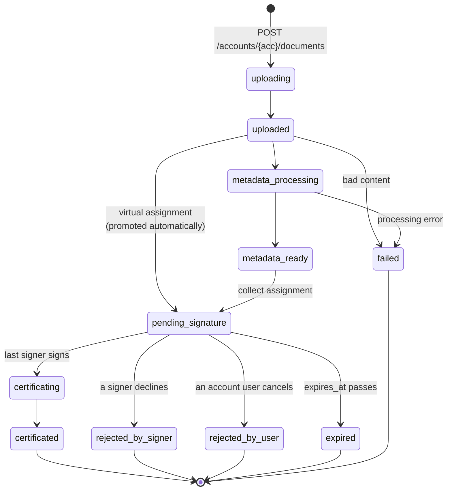

# Assinafy para WordPress

*Português · [Read in English](README.en.md)*

Envie um PDF do WordPress para assinatura eletrônica com a [Assinafy](https://www.assinafy.com.br/)
e acompanhe-o do upload ao artefato assinado sem sair do admin.

Este documento descreve o código-fonte atual do plugin e seu contrato de integração. Os payloads
da API são exemplos ilustrativos, com identidades e credenciais fictícias; saldos, preços,
tempos e recursos disponíveis na conta devem ser lidos da conta configurada.

- [1. O que este plugin faz](#1-o-que-este-plugin-faz)
- [2. Requisitos e instalação](#2-requisitos-e-instalação)
- [3. Configuração](#3-configuração)
- [4. O fluxo do documento, passo a passo](#4-o-fluxo-do-documento-passo-a-passo)
- [5. Pontos de extensão](#5-pontos-de-extensão)
- [6. WP-CLI](#6-wp-cli)
- [7. Webhooks](#7-webhooks)
- [8. WooCommerce](#8-woocommerce)
- [9. Referência de chamadas do SDK](#9-referência-de-chamadas-do-sdk)
- [10. Solução de problemas](#10-solução-de-problemas)
- [11. Desenvolvimento](#11-desenvolvimento)
- [Comportamento em multisite e privacidade](#comportamento-em-multisite-e-privacidade)

---

Os resultados detalhados da verificação, as correções e os limites de cobertura estão em `AUDIT.md`
no checkout do código-fonte. Esse relatório interno de auditoria é excluído dos ZIPs de release.
O contrato entre core e adaptadores e o rollout das integrações estão em [docs/integrations.md](docs/integrations.md).

## 1. O que este plugin faz

Ele envia um PDF para uma conta Assinafy, pede que pessoas nomeadas o assinem, espelha o estado
remoto em um custom post type do WordPress e entrega os artefatos finalizados de volta por um
proxy protegido por capability. Todo o resto do plugin — a tela de configurações, o receptor de
webhook, o cron de reconciliação, o WP-CLI, o WooCommerce — existe para tornar esse único caminho
confiável.

O core é dono do envio, da recuperação, do armazenamento, dos webhooks e da sincronização.
Comportamento específico de cada host pertence aos adaptadores. WooCommerce e Elementor Forms são
entregues como adaptadores embutidos. Gravity Forms, Contact Form 7 e WPForms têm add-ons de
desenvolvimento separados no checkout do código-fonte, em `addons/`, na versão 0.1.0. Cada um envia
um PDF existente com nome/e-mail do signatário mapeados através do core. CF7 e WPForms Lite são
testados contra plugins host gratuitos reais; Gravity Forms e Elementor Pro têm apenas testes
documentados de contrato de API, pendentes de validação com instalação licenciada. A vinculação de
entradas do WPForms Pro também não foi verificada em um host licenciado. Um produto WooCommerce
separado só vem depois que seu workflow de contrato estiver definido. Veja
[o guia de adaptadores](docs/integrations.md#rollout) e a [configuração do Elementor](docs/elementor.md).

### Adaptadores de formulário

| Adaptador | Instalação | Disparo e recuperação | Limite de verificação |
| --- | --- | --- | --- |
| Gravity Forms | Add-on separado `assinafy-gravity-forms` | Feed nativo em segundo plano; regras condicionais; identidade única por entrada/feed; retentativa na página da entrada | Exige Gravity Forms 2.9.4+; apenas dublês de host documentados |
| Contact Form 7 | Add-on separado `assinafy-contact-form-7` | Resultado de e-mail aceito com sucesso e consentimento configurado; recibo do core e retentativa protegida | CF7 6.1.7 real |
| WPForms | Add-on separado `assinafy-wpforms` | Processamento bem-sucedido; recibo do core mesmo sem armazenamento de entradas no Lite; retentativa protegida | WPForms Lite 2.0.1.1 real; Pro não verificado em execução |
| Elementor Forms | Incluído no core; adicione a ação Assinafy | Ação de formulário nativa, deduplicação de callback no mesmo registro; detalhes de erro de recuperação do core | Exige Elementor Pro; apenas dublês de host documentados; sem UI de retentativa no formulário |

Estes são fluxos iniciais de envio de PDF. Eles não geram contratos, não mesclam valores do
formulário dentro de PDFs, não exigem pagamento e não condicionam a entrega a uma assinatura.
Configure o consentimento no host. CF7 e WPForms guardam a configuração mínima de retentativa no
documento do core, não a submissão completa. Submissões distintas aceitas sem entrada armazenada
são requisições distintas, mesmo com valores idênticos; retentativas de callback reutilizam o
recibo. A eliminação por privacidade bloqueia o reenvio a contatos apagados. A tela de documento do
core continua sendo o lugar compartilhado para status, links de assinatura e downloads.

Construa o core com `bin/build-zip.sh` e depois rode `bin/build-addons.sh` para criar os três ZIPs
separados em `dist/addons/`. O ZIP do core exclui `addons/`; instale apenas o add-on do plugin de
formulário que você usa. Cada diretório de add-on inclui seu próprio README de configuração e um
`readme.txt`. Esses artefatos são builds de desenvolvimento, não releases publicados no
WordPress.org. O Plugin Check oficial não reporta erros; os add-ons ainda têm avisos de revisão de
diretório porque o core exigido não está listado, e o nome/slug do WPForms é sinalizado. Esses
avisos e a validação em host licenciado continuam sendo travas de release.

### O modelo de domínio

A Assinafy **não tem envelope**. O grafo de objetos é plano, e entender seus cinco substantivos é
quase tudo de que você precisa:

| Entidade | Escopo | Identidade | O que é |
|---|---|---|---|
| **Account** | workspace | `{ACCOUNT_ID}` | Coleções da conta usam `accounts/{accountId}/…`; operações em documentos individuais usam `documents/{documentId}/…`. |
| **Document** | conta | string hexadecimal opaca | O PDF e seu ciclo de vida. Carrega `artifacts`, `pages[]`, `tags[]` e um `assignment` embutido. |
| **Signer** | conta | string hexadecimal opaca | Um registro de pessoa reutilizável. **`email` é único por conta.** |
| **Assignment** | documento, 1:1, permanente | string hexadecimal opaca | A própria solicitação de assinatura. Um por documento, para sempre. Não existe rota de atualização. |
| **Artifact** | documento | um nome, não um id | Um arquivo baixável derivado do documento: `original`, `certificated`, `certificate-page`, `pades`, `bundle`. |

Os ids são **strings hexadecimais opacas de comprimento variável** — 26 a 28 caracteres observados
em uma conta. Guarde-os como strings. Nunca valide com uma regex de comprimento fixo.

Três consequências saem direto do modelo e moldam o plugin inteiro:

1. **Um assignment não pode ser editado.** Trocar um signatário, uma mensagem ou um método
   significa subir o documento de novo. O plugin oferece reenviar, estender e cancelar — as três
   operações pós-envio que a API realmente tem — e nada que finja ser uma edição.
2. **Um signatário é identificado pelo e-mail, em toda a conta.** Enviar para a mesma pessoa duas
   vezes exige buscar o signatário antes de criar um, ou o segundo envio falha.
3. **Os endpoints de artefato exigem autenticação da conta.** O plugin guarda os nomes dos
   artefatos e usa o [`DownloadProxy`](src/Documents/DownloadProxy.php) para buscar seus bytes no
   servidor com a credencial da conexão. Os links de download do navegador apontam para o proxy do
   WordPress, que verifica permissões.

### A máquina de estados

Um documento passa por exatamente onze status. `is_closed: true` marca todos os terminais —
responda "isto acabou?" por essa flag, não por uma lista mantida à mão.



| Código | Excluível | Significado |
|---|---|---|
| `uploading` | não | Transitório, raramente observado. |
| `uploaded` | não | Bytes aceitos. `pages: []`. Um assignment **virtual** pode já existir. |
| `metadata_processing` | não | Páginas sendo renderizadas. `pages[]` é preenchido durante este estado. |
| `metadata_ready` | **sim** | Páginas renderizadas, miniatura disponível. |
| `pending_signature` | **sim** | Signatários notificados. Excluir é o único cancelamento que a API oferece. |
| `certificating` | não | O último signatário assinou; a plataforma está selando o PDF. |
| `certificated` | não | Sucesso terminal; marcado como não excluível no catálogo de status atual. |
| `rejected_by_signer` | **sim** | Um signatário recusou. Terminal. |
| `rejected_by_user` | **sim** | Um usuário da conta cancelou. Terminal. |
| `expired` | **sim** | `expires_at` passou. Terminal. |
| `failed` | **sim** | Conteúdo rejeitado ou falha no processamento. Terminal. |

**Não existe status `ready`**. `document_ready` — o evento de webhook — significa "o último
signatário assinou", não um status com esse nome.

O plugin cria um assignment virtual depois do upload, sem fazer polling por `metadata_ready`.
As respostas seguintes da API e a reconciliação fornecem o status de processamento/assinatura do
documento.

### Métodos de verificação e de notificação

O plugin suporta três métodos de verificação e um canal de notificação por signatário. Os valores
são PascalCase; combinações incompatíveis de método/canal são rejeitadas localmente.

| `verification_method` | `notification_methods` | Custo | Exige |
|---|---|---|---|
| `Email` | `["Email"]` | Estimativa da conta | E-mail, ou um ID de signatário existente |
| `Whatsapp` | `["Whatsapp"]` | Estimativa da conta; restrições de plano podem se aplicar | Número de telefone, ou um ID de signatário existente |
| `DigitalCertificate` | `["Email"]` ou `["Whatsapp"]` | Estimativa da conta; o recurso precisa estar habilitado | ID de signatário existente com documento de identificação configurado na Assinafy; signatário sozinho em sua etapa |

[`Signers`](src/Documents/Signers.php) valida o pareamento. Omitir o método e o canal usa `Email`
como padrão quando há e-mail ou quando nenhum telefone é informado, e `Whatsapp` caso contrário.
Canais explícitos suportados são preservados.

Esses três são todo o vocabulário de verificação. O plugin não oferece nenhum método que a API não
implemente.

---

## 2. Requisitos e instalação

| | Mínimo | Por quê |
|---|---|---|
| PHP | **8.2** | O `assinafy/php-sdk` exige `^8.2`. O bootstrap mostra um aviso no admin e retorna em qualquer versão anterior, em vez de causar um erro fatal. |
| WordPress | **6.8** | A release que estendeu o carregamento just-in-time de traduções a todos os plugins. As traduções são distribuídas como language packs do wordpress.org e carregam a partir de `WP_LANG_DIR` sem o plugin pedir, portanto não há chamada a `load_plugin_textdomain()` nem catálogo compilado no pacote. |
| Testado até | 7.1 | |
| Extensões | `sodium`, `mbstring` | Criptografia das credenciais e tratamento de Unicode pelo SDK; JSON já vem embutido nas versões de PHP suportadas. |
| TLS | **1.2** | O plugin exige TLS 1.2 ou superior nas próprias requisições à Assinafy (transporte cURL do WordPress). No transporte por streams, sem cURL, vale o padrão do PHP/OpenSSL do servidor. |
| WooCommerce (opcional) | **10.2.2** | Testado com WooCommerce 10.2.2 e 11.1.0; o core também inicia sem o WooCommerce. |

WooCommerce e WP-CLI são opcionais; cada integração carrega apenas quando seu host está presente.

### Instalando uma release

Baixe `assinafy-<version>.zip` na página de releases e instale por
**Plugins → Adicionar novo → Enviar plugin**. O zip já traz a árvore de dependências com prefixo;
nada precisa ser compilado no servidor.

### Instalando a partir do código-fonte

```bash
# From a checkout or extracted source tree named assinafy:
cd assinafy
composer install
```

O `composer install` roda o [Strauss](https://github.com/BrianHenryIE/strauss) no
`post-install-cmd`, que copia a árvore de dependências para `vendor-prefixed/` e reescreve
`Psr\Log\` como `Assinafy\WP\Vendor\Psr\Log\`. **O plugin carrega `vendor-prefixed/autoload.php`
e nunca `vendor/autoload.php`** — é ali que estão as classes distribuídas.

O SDK em si mantém o namespace `Assinafy\SDK\`. A coexistência com outro plugin que carregue uma
versão incompatível do SDK não foi verificada; apenas o logger PSR embutido recebe prefixo sob
`Assinafy\WP\Vendor\`.

### Sem Guzzle, por design

O `composer.json` declara `replace` para toda a árvore do Guzzle, então ela nunca é instalada:

```json
"replace": {
    "guzzlehttp/guzzle": "*", "guzzlehttp/promises": "*", "guzzlehttp/psr7": "*",
    "psr/http-client": "*", "psr/http-factory": "*", "psr/http-message": "*",
    "symfony/polyfill-php80": "*", "symfony/polyfill-php82": "*"
}
```

O `AssinafyClient` do SDK aceita um transporte injetado, e o plugin fornece o
[`WpHttpClient`](src/Http/WpHttpClient.php), construído sobre `wp_remote_request()`. Isso elimina
um erro fatal em todo o site: `GuzzleHttp\Client` é exatamente o mesmo nome de classe totalmente
qualificado no Guzzle 6, 7 e 8, então dois plugins embutindo majors diferentes colidem no nível da
classe e derrubam o site inteiro. Não distribuir Guzzle nenhum apaga esse modo de falha, e o job de
CI `runtime-smoke` verifica `class_exists( 'GuzzleHttp\Client' ) === false` na árvore de produção em
todo pipeline.

Isso também significa que **o plugin nunca deve chamar `AssinafyClient::create()`, `::fromArray()`,
`::forAuth()` ou `::forBearer()`** — cada um recorre ao transporte Guzzle ausente. O
[`ClientFactory`](src/ClientFactory.php) constrói os clientes de API; o
[`OAuthTokens`](src/OAuthTokens.php) constrói o cliente público da troca OAuth. Ambos injetam
`WpHttpClient`:

```php
$config = new Assinafy\SDK\Configuration( $api_key, $account_id, $base_url, 30, 10 );
$client = new Assinafy\SDK\AssinafyClient( $config, new Assinafy\WP\Http\WpHttpClient( $config ) );
```

Passar por `wp_remote_request()` também entrega de graça o proxy configurado no site
(`WP_PROXY_*`), o respeito a `WP_HTTP_BLOCK_EXTERNAL`, as configurações de SSL do próprio site e a
superfície de filtros `http_request_*` já existente.

### Gerando o zip de distribuição

```bash
composer install  # Includes Strauss, the development tool that builds vendor-prefixed/.
bin/build-zip.sh
# Built /path/to/dist/assinafy-1.1.1.zip
```

O `bin/build-zip.sh` aplica o `.distignore` e depois se recusa a produzir um zip a menos que o
cabeçalho `Version:` do plugin, a constante de runtime `ASSINAFY_VERSION` e o `Stable tag:` do
readme concordem, nenhum `namespace GuzzleHttp` apareça em qualquer lugar da árvore preparada, o
`vendor-prefixed/autoload.php` tenha sobrevivido e a árvore `vendor/` sem prefixo não. Defina
`ASSINAFY_DIST_DIR` para gerar o build em outro lugar que não `dist/`.

---

## 3. Configuração

As configurações ficam em **Assinafy → Configurações** (capability `manage_options`).

| Configuração | Option | Padrão |
|---|---|---|
| Ambiente | `assinafy_environment` | `production` |
| ID da conta | `assinafy_account_id` | `''` |
| Chave de API | `assinafy_api_key_enc` | `''` (armazenada criptografada) |
| Conexão OAuth | `assinafy_oauth_connection_enc` | `''` (armazenada criptografada) |
| Modo de autenticação | `assinafy_auth_mode` | `''` (legado até conectar) |
| Aceitar entregas de webhook | `assinafy_webhook_enabled` | `false` |
| Token do endpoint de webhook | `assinafy_webhook_token` | gerado na ativação |
| Prazo para assinatura (dias) | `assinafy_default_expiry_days` | `30` |
| Mensagem aos signatários | `assinafy_default_message` | `''` |
| Capability exigida para enviar | `assinafy_sender_cap` | `assinafy_send` |
| Apagar dados ao desinstalar | `assinafy_delete_data_on_uninstall` | `false` |

[`Settings::OPTIONS`](src/Settings.php) é o registro único de onde tudo isso é lido — o registro
das options, a tela e o `uninstall.php` iteram o mesmo mapa, então uma option não pode ser
adicionada em um lugar e esquecida em outro.

### OAuth para produção

Na tela **Assinafy → Configurações**, escolha Produção e clique **Conectar Assinafy** em um site
HTTPS. O consentimento da Assinafy abre em uma nova aba. Copie o código exibido após a aprovação e
cole na aba de configurações do WordPress em até 60 segundos. A conta escolhida é descoberta com o
token aprovado; não é necessário copiar ID da conta nem chave de API.
O fluxo usa Authorization Code com PKCE S256, cliente público e uma rota de callback dedicada.
O serviço de callback valida estado e emissor e exibe o código somente nessa aba; o verificador PKCE e os tokens ficam
no WordPress. Tokens de acesso e refresh são criptografados, o refresh é rotativo, e a conexão
precisa ser refeita após 30 dias. **Desconectar** tenta revogar o refresh token e sempre remove a
conexão local; se a revogação remota falhar, revogue o app em Assinafy Connected Apps.

Para registrar o app público **Assinafy para WordPress**, use:

- Callback: `https://integrations.assinafy.com.br/wordpress/oauth-callback`
- Ícone SVG: `https://integrations.assinafy.com.br/wordpress/wordpress-icon.svg`
- Escopos: `account:read documents:read documents:write webhooks:write offline_access`
- Descrição: “Conecta sites WordPress à Assinafy para enviar documentos para assinatura, acompanhar o andamento e receber atualizações.”

O `client_id` público está incluído no plugin e no serviço de callback. A rota hospedada aceita
apenas esse app registrado. Não há client secret nem DCR.

### Credenciais

A chave de API legada e a conexão OAuth são criptografadas em repouso com libsodium. O blob armazenado é
`hex( version-byte || nonce || secretbox )`; o byte de versão inicial existe para que uma futura
mudança na derivação da chave seja *detectável*, em vez de produzir lixo silenciosamente.
Novas credenciais exigem um `LOGGED_IN_KEY`, `LOGGED_IN_SALT` ou `SECRET_KEY` único no `wp-config.php`,
ou `ASSINAFY_ENCRYPTION_KEY`. Os salts gerados e armazenados pelo WordPress no banco não protegem
as credenciais contra um vazamento do próprio banco. Valores já salvos continuam legíveis; adicionar
`ASSINAFY_ENCRYPTION_KEY` depois de salvar credenciais exige uma nova conexão ou chave de API.

O campo é renderizado com `value=""` para que o texto cifrado nunca chegue ao navegador, o que
significa que todo salvamento que não muda a chave chega em branco. **Em branco significa manter**
— um filtro `pre_update_option_assinafy_api_key_enc` restaura o valor armazenado.

Uma falha de descriptografia retorna um `WP_Error` distinguível, nunca uma string vazia:

| Código de erro | Significado |
|---|---|
| `assinafy_credentials_unreadable` | O blob não descriptografa. Quase sempre uma rotação de salts. Informe a chave de novo. |
| `assinafy_credentials_key_version` | Escrito por outra versão de derivação de chave. Informe a chave de novo. |

Se esses casos retornassem `''`, um site cujos salts fossem rotacionados se reportaria como "não
configurado" e a causa real nunca apareceria.

### Constantes no wp-config.php

Para conexões legadas e Sandbox, constantes `ASSINAFY_API_KEY` e `ASSINAFY_ACCOUNT_ID` com string não vazia sobrepõem as options
salvas e deixam esses dois campos da tela somente leitura. `ASSINAFY_ENCRYPTION_KEY` fornece,
opcionalmente, o material de chave para criptografia; ela não tem campo na tela de configurações.

```php
// wp-config.php

/** API key, taking precedence over the encrypted option. */
define( 'ASSINAFY_API_KEY', '{API_KEY}' );

/** Account id, taking precedence over the stored option. */
define( 'ASSINAFY_ACCOUNT_ID', '{ACCOUNT_ID}' );

/**
 * Key material for encrypting stored credentials. Optional when WordPress
 * security keys and salts are unique in wp-config.php. Without it the key
 * comes from wp_salt( 'logged_in' ); rotating salts invalidates stored values.
 */
define( 'ASSINAFY_ENCRYPTION_KEY', 'a long random string, generated once, never committed' );
```

`ASSINAFY_ENCRYPTION_KEY` é a opção a usar se o seu deploy rotaciona salts, ou se você quer o
material de chave completamente fora do banco de dados. Ela passa por
`sodium_crypto_generichash` até 32 bytes, então o comprimento dela não importa — a entropia sim.

Em conexões legadas e Sandbox, `ASSINAFY_API_KEY` e `ASSINAFY_ACCOUNT_ID` dispensam o armazenamento
da chave no banco. As constantes não apagam credenciais salvas. Após conectar OAuth na Produção,
o plugin usa o workspace aprovado e ignora as constantes para chamadas de produção.

### Escolha do ambiente

A option de ambiente mapeia para uma base URL a partir das constantes do próprio SDK. Ela nunca é
um campo de texto livre — uma URL que o usuário pode digitar é um convite a apontar uma requisição
autenticada para outra origem.

| Configuração | Base URL | Host dos links de assinatura |
|---|---|---|
| `production` (padrão) | `https://api.assinafy.com.br/v1` | `app.assinafy.com.br` |
| `sandbox` | `https://sandbox.assinafy.com.br/v1` | `app-sandbox.assinafy.com.br` |

Documentos do ambiente de testes (sandbox) não têm efeito legal e são cobrados separadamente.

### Capabilities

Três capabilities personalizadas são instaladas na ativação:

| Capability | Concedida a | Protege |
|---|---|---|
| `assinafy_send` | administrator, editor | A tela de envio, reenviar, estender, renomear |
| `assinafy_manage` | administrator | Cancelar |
| `assinafy_view` | administrator, editor, author | O menu Assinafy, a lista de documentos, os downloads |

O post type do documento declara
`capability_type => array( 'assinafy_document', 'assinafy_documents' )` com
`map_meta_cap => true`, e [`Capabilities::map_meta_cap()`](src/Capabilities.php) reescreve as
primitivas expandidas (`edit_assinafy_documents`, `delete_others_assinafy_documents`, …) sobre
essas três. Um post type deixado em `capability_type => 'post'` mapearia tudo de volta para
`edit_posts` e as capabilities personalizadas não protegeriam absolutamente nada.

A capability de compor/enviar no admin é configurável por `assinafy_sender_cap`. Reenviar,
estender e renomear continuam exigindo `assinafy_send`. Essas permissões valem para todos os
registros Assinafy do site, não apenas para os registros criados pelo usuário atual. Integrações
diretas em PHP precisam impor a própria autorização do host antes de chamar o serviço ou as ações
de envio.

---

## 4. O fluxo do documento, passo a passo

O caminho principal do plugin: **método `virtual`, verificação por e-mail, todos os
signatários em paralelo na etapa 1.** Ele vai da validação local à precificação, à resolução
de signatários, ao upload, à criação do assignment, aos links de assinatura, à sincronização
de status e à entrega do PDF assinado. Os passos 0–4 rodam através de
[`SendService::send()`](src/Documents/SendService.php); os chamadores do admin, dos hooks, do
WooCommerce, da CLI e do cron compartilham o mesmo serviço de envio.

Cada passo, com as requisições e respostas exatas, está documentado em
[docs/document-flow.md](docs/document-flow.md).

---

## 5. Pontos de extensão

Os adaptadores se registram por `assinafy_ready( $send, $records )` depois do boot do core e usam o
serviço de envio compartilhado, os acessores de documento e as actions nativas abaixo. Veja
[docs/integrations.md](docs/integrations.md) para propriedade, roteamento de origem e fronteiras
entre pacotes.

### `assinafy_send_document` — enviar agora

O ponto de entrada universal. Qualquer tema, plugin de formulário ou integração sob medida pode
solicitar uma assinatura com uma linha e sem acoplamento às classes deste plugin.

```php
do_action(
	'assinafy_send_document',
	array(
		'attachment_id'   => 412,
		'signers'         => array(
			array( 'full_name' => 'Jane Doe', 'email' => 'jane@example.com' ),
		),
		'message'         => 'Please review and sign the attached agreement.',
		'idempotency_key' => 'contact-form-7-entry-1187',
	)
);
```

A action roda de forma síncrona. A quantidade de requisições e a duração dependem da estimativa de
custo, da busca ou criação de signatários, do upload, do assignment e de haver ou não um envio
anterior sendo retomado.

### `assinafy_send_document_async` — enviar no próximo tick do cron

Os mesmos `$args`, agendados com `wp_schedule_single_event()` e retornando imediatamente. Use a
partir de uma requisição de front-end, de um callback de pagamento ou de qualquer coisa que não
possa ficar bloqueada por uma API de terceiros.

```php
do_action( 'assinafy_send_document_async', $args );
```

O evento agendado dispara novamente `assinafy_send_document`, então o caminho adiado passa
exatamente pelo mesmo handler do caminho inline, e qualquer listener que você tenha adicionado à
action pública também enxerga o envio adiado. O WordPress ainda recusa um segundo agendamento
idêntico dentro de dez minutos, o que é uma camada extra e gratuita de proteção contra envio
duplicado.

### O contrato de `$args`

Ambas as actions recebem exatamente um argumento, um array associativo, repassado a
`SendService::send()` sem alteração.

Informe `attachment_id` ou `file_path`; um ID de anexo positivo tem precedência quando ambos são
fornecidos pela API PHP. A CLI rejeita o envio dos dois.

| Chave | Tipo | Observações |
|---|---|---|
| `attachment_id` | `int` | Anexo da biblioteca de mídia cujo `post_mime_type` é `application/pdf`. |
| `file_path` | `string` | Caminho absoluto para um PDF legível neste servidor. |

Também obrigatório:

| Chave | Tipo | Observações |
|---|---|---|
| `signers` | `array<int, array>` | Pelo menos uma entrada. |

Cada linha de signatário aceita:

| Chave | Tipo | Observações |
|---|---|---|
| `full_name` (ou `name`) | `string` | Obrigatório, a menos que `id` seja informado. |
| `email` | `string` | Obrigatório para verificação por Email, a menos que um ID de signatário existente seja informado. Linhas só com telefone assumem Whatsapp. |
| `whatsapp_phone_number` (ou `phone`) | `string` | E.164. Números nacionais crus de 10/11 dígitos recebem `+55`. |
| `step` | `int` | Informe para todos os signatários ou omita para todos. O padrão é 1; etapas explícitas começam em 1 sem lacunas. Signatários DigitalCertificate precisam de uma etapa só deles. |
| `verification_method` | `string` | `Email`, `Whatsapp` ou `DigitalCertificate`. DigitalCertificate exige um ID de signatário existente com documento de identificação configurado na Assinafy. |
| `notification_methods` | `array<string>` | Exatamente um canal `Email` ou `Whatsapp`. A verificação por Email/Whatsapp exige o canal correspondente; DigitalCertificate aceita qualquer um dos dois. |
| `id` | `string` | Um id de signatário Assinafy existente, usado como está em vez do buscar-e-criar. |

Chaves opcionais de nível superior:

| Chave | Tipo | Observações |
|---|---|---|
| `message` | `string` | Corpo do convite. Recorre a `assinafy_default_message`. |
| `expires_at` | `string` | ISO 8601 com `Z` ou um deslocamento `±HH:MM`. Recorre à janela de expiração configurada. |
| `post_id` | `int` | Um registro `assinafy_document` vazio para reaproveitar. Histórico remoto de assinatura existente nunca é sobrescrito. |
| `source` | `array` | `{integration: string, record_id: string}` opcional, identificando o registro no host. Veja o [schema exato e as regras de retentativa](docs/integrations.md#source-reference). |
| `idempotency_key` | `string` | Identificador estável para este envio. |

**Derive a `idempotency_key` do evento que torna o envio único** — por exemplo, um id de pedido e
um id de anexo. Reutilize-a em retentativas; use uma chave nova para um novo envio intencional. A
chave tem escopo na conta e no ambiente configurados; adaptadores precisam incluir seu provedor,
registro e workflow nas chaves fornecidas. Sem uma chave explícita, o plugin gera um hash do
conteúdo do PDF, dos signatários normalizados, do post de destino, do autor, da mensagem, da origem
e da política de expiração. Chaves concluídas permanecem vinculadas aos seus registros depois que o
transient de cinco minutos expira, e envios parciais são retomados contra o upload salvo. O
formulário de composição do admin gera um id de requisição por formulário, mantido entre submissões
duplicadas.

### `assinafy_send_document_result` — observar o resultado

Dispara depois de qualquer envio via hook, inline ou adiado, com o id do post espelho ou um
`WP_Error`. Chamadas diretas a `SendService::send()` retornam o resultado para quem chamou.

```php
add_action(
	'assinafy_send_document_result',
	function ( $result, array $args ) {
		if ( is_wp_error( $result ) ) {
			error_log( 'Assinafy send failed: ' . $result->get_error_message() );
			return;
		}

		// $result is the local Assinafy mirror ID, not the source entry/order ID.
		// An adapter can route its host update using $args['source'].
		error_log( sprintf( 'Assinafy document record: %d', $result ) );
	},
	10,
	2
);
```

O wrapper do hook reporta erros do serviço de envio e exceções capturadas por essa action de
resultado. Handlers de resultado devem tratar erros sem lançar exceções. Erros de validação
antecipada e de agendamento podem ser reportados sem entrada no log; erros de agendamento do
WordPress Cron também podem chegar a essa action.

Códigos de `WP_Error` nos quais você pode ramificar:

| Código | Significado |
|---|---|
| `assinafy_send_invalid_args` | `$args` não era um array. |
| `assinafy_send_no_document` | Nem `file_path` nem `attachment_id`. |
| `assinafy_send_no_signers` | `signers` ausente ou vazio. |
| `assinafy_not_configured` | Falta a chave de API ou o ID da conta. |
| `assinafy_not_a_pdf` | O mime type do anexo não é `application/pdf`. |
| `assinafy_file_missing` | O anexo não tem arquivo em disco. |
| `assinafy_no_file` | Nenhuma origem de arquivo foi resolvida. |
| `assinafy_invalid_pdf` | A checagem local de `assertUploadable()` falhou. |
| `assinafy_signer_incomplete` | Campos de signatário malformados, métodos/canais incompatíveis, identidades duplicadas ou etapas de assinatura inválidas. |
| `assinafy_signer_email` | Um endereço de e-mail de signatário não é válido. |
| `assinafy_signer_contact` | Um signatário não tem e-mail, nem telefone, nem id. |
| `assinafy_send_in_progress` | O lock está retido por um envio em andamento. |
| `assinafy_insufficient_resources` | `has_sufficient_resources: false`, carregando a mensagem de `blocking_reason`. |
| `assinafy_plan_restricted` | 403 do `estimate-cost` — o método não está neste plano. |
| `assinafy_send_failed` | Falha de workflow, de API, de persistência ou de upload incerto. Os dados do erro podem conter um `post_id` de recuperação. |
| `assinafy_invalid_source` | A origem não corresponde ao schema documentado. |
| `assinafy_source_conflict` | A origem não pode ser salva ou difere da requisição existente. |
| `assinafy_invalid_expiry` | Prazo inválido ou no passado. |
| `assinafy_credentials_key_version` | A credencial armazenada usa uma versão de chave não suportada. |
| `assinafy_credentials_unreadable` | A credencial armazenada não pode ser descriptografada. |
| `assinafy_client_unavailable` | Falha ao construir o client. |

### `assinafy_document_status_changed` — toda transição

Dispara a partir do [`StatusSync`](src/Documents/StatusSync.php) quando o cron, um webhook, a CLI
ou um refresh no admin encontra um status diferente do valor armazenado. Um signatário pode
progredir sem mudar o status do documento; isso sozinho não dispara esta action.

```php
add_action(
	'assinafy_document_status_changed',
	function ( int $post_id, string $current, string $previous ) {
		if ( 'pending_signature' === $current && 'uploaded' === $previous ) {
			// Assinafy finished rendering pages and released the invitations.
		}
	},
	10,
	3
);
```

`$previous` só fica vazio quando nenhum status havia sido espelhado antes. Uploads normalmente
registram seu status inicial antes da primeira sincronização posterior.

### Os quatro hooks terminais

Estas actions acompanham uma transição detectada para um status terminal, junto de
`assinafy_document_status_changed`. Elas não são notificações duráveis nem exatamente-uma-vez; os
handlers precisam ser idempotentes. O segundo argumento é o documento **exatamente como a API o
retornou** — o payload completo do [Passo 6](docs/document-flow.md#passo-6--acompanhar-o-progresso), com `assignment` e
`pages` incluídos.

| Action | Dispara no status |
|---|---|
| `assinafy_document_certificated` | `certificated` |
| `assinafy_document_rejected` | `rejected_by_signer` ou `rejected_by_user` |
| `assinafy_document_expired` | `expired` |
| `assinafy_document_failed` | `failed` |

```php
add_action(
	'assinafy_document_certificated',
	function ( int $post_id, array $document ) {
		// Artifact endpoints require account authentication; read their names here.
		$artifacts = array_keys( (array) ( $document['artifacts'] ?? array() ) );

		if ( in_array( 'certificated', $artifacts, true ) ) {
			wp_mail(
				get_option( 'admin_email' ),
				'Signed: ' . get_the_title( $post_id ),
				admin_url( 'post.php?post=' . $post_id . '&action=edit' )
			);
		}
	},
	10,
	2
);

add_action(
	'assinafy_document_rejected',
	function ( int $post_id, array $document ) {
		// decline_reason and declined_by are populated on a signer decline.
		$reason = (string) ( $document['decline_reason'] ?? '' );

		error_log( sprintf( 'Assinafy document %d declined: %s', $post_id, $reason ) );
	},
	10,
	2
);
```

Não existe hook de "todos assinaram", porque não existe esse status: a última assinatura move o
documento para `certificating` e depois para `certificated`.

### `assinafy_reconcile` — o hook do cron

`Plugin::CRON_HOOK`, agendado de hora em hora na ativação e ligado a `StatusSync::reconcile()`.
Dispare você mesmo para forçar uma varredura:

```php
do_action( 'assinafy_reconcile' );
```

Ou desagende o evento do WP-Cron e o conduza por um timer do sistema — veja a [§6](#6-wp-cli).

### Lendo um registro

O [`DocumentRecord`](src/Documents/DocumentRecord.php) declara as meta keys do espelho do documento
e fornece os acessores suportados. As chaves de produto/pedido do WooCommerce pertencem ao seu
adaptador. Não leia as metas diretamente; a maioria dos nomes de chave é privada e os formatos JSON
não fazem parte do contrato. Para encontrar um registro, em vez de ler um, use o
[`DocumentIndex`](src/Documents/DocumentIndex.php).

```php
$records = new Assinafy\WP\Documents\DocumentRecord();

$records->document_id( $post_id );    // string, '' when not yet sent
$records->status( $post_id );         // one of the eleven status codes
$records->is_closed( $post_id );      // bool
$records->assignment_id( $post_id );  // string
$records->artifacts( $post_id );      // array<int, string> — NAMES, never URLs
$records->synced_at( $post_id );      // int, last hydration or reconciliation visit, including a failed visit
$records->last_error( $post_id );     // string, last recorded send/sync error
$records->source( $post_id );         // integration + record_id, or array() for unattributed records

foreach ( $records->signers( $post_id ) as $signer ) {
	// id, name, email, step, notified, completed, signing_url
	echo esc_html( $signer['name'] ), ' — ', $signer['completed'] ? 'signed' : 'pending';
}
```

Para downloads autenticados de artefatos, use o construtor de URL do proxy. Ele inclui o nonce; as
permissões são verificadas quando o link é seguido:

```php
$url = Assinafy\WP\Documents\DownloadProxy::url( $post_id, 'certificated' );
```

---

## 6. WP-CLI

Registrado apenas quando o WP-CLI está carregado. Quatro subcomandos, todos funcionais; não há
stubs.

### `wp assinafy status`

Reporta como este site está conectado. Contatar a conta custa uma requisição; ler a assinatura do
plano custa uma segunda.

```
$ wp assinafy status
+----------------------+---------------------------------------------------------------+
| field                | value                                                         |
+----------------------+---------------------------------------------------------------+
| Environment          | production                                                    |
| API base URL         | https://api.assinafy.com.br/v1                                |
| Credentials          | configured                                                    |
| Account              | Acme Inc. ({ACCOUNT_ID})                                      |
| This site endpoint   | https://example.com/wp-json/assinafy/v1/webhook/<token>       |
| Webhook subscription | https://example.com/wp-json/assinafy/v1/webhook/<token>       |
| Webhook delivering   | yes                                                           |
| Webhook events       | document_metadata_ready, document_ready, signer_signed_doc…   |
| Rate budget          | 117 requests left, window resets in 44s (read 3s ago)         |
+----------------------+---------------------------------------------------------------+
```

`[--format=<table|json|csv|yaml>]`. Uma credencial não configurada ou ilegível aparece na linha
`Credentials` em vez de fazer o comando falhar, então a saída continua útil em um health check:

```bash
wp assinafy status --format=json | jq -e 'any(.[]; .field=="Account" and (.value | startswith("unreachable: ") | not))'
```

### `wp assinafy send`

```
$ wp assinafy send --file=/srv/contracts/nda.pdf --signers="Jane Doe <jane@example.com>"
Success: Sent. Local record: post 4187.
```

| Opção | Observações |
|---|---|
| `--file=<path>` | Caminho do PDF. Mutuamente exclusivo com `--attachment`. |
| `--attachment=<id>` | Id do anexo na biblioteca de mídia. Mutuamente exclusivo com `--file`. |
| `--signers=<list>` | Separados por vírgula. Cada entrada é `Full Name <address@example.com>` ou apenas um endereço, caso em que o endereço também serve de nome. |
| `--message=<text>` | Usa por padrão a mensagem configurada. |
| `--expires=<datetime>` | ISO 8601 com `Z` ou `±HH:MM`, por exemplo `2026-12-31T23:59:59Z`. |
| `--key=<idempotency-key>` | Repetir o comando com a mesma chave reutiliza ou retoma o envio registrado. Use uma chave nova para um novo contrato/versão intencional. |
| `--porcelain` | Imprime o ID do registro Assinafy local, inclusive um ID existente em um envio deduplicado. |

A chave padrão da CLI faz o hash do caminho/anexo selecionado e dos signatários interpretados. Ela
não inclui mudanças nos bytes do PDF, na mensagem ou na expiração. Use uma `--key` nova e explícita
para um novo envio intencional quando esses detalhes mudarem, e reutilize essa chave em
retentativas.

```bash
# Two signers, in parallel on step 1.
wp assinafy send --attachment=412 --signers="jane@example.com,sam@example.com"

# Capture the post id for a shell script.
POST=$(wp assinafy send --attachment=412 --signers=jane@example.com --porcelain)
```

### `wp assinafy sync`

```
$ wp assinafy sync
Success: Reconcile pass finished.

$ wp assinafy sync 104618b275d321f5de22240ebfda
Success: Refreshed 104618b275d321f5de22240ebfda.
```

Sem argumento, este comando roda a mesma passada que o cron horário roda. Com um id de documento,
ele relê aquele documento. De um jeito ou de outro, o estado local é escrito a partir da resposta
da API, nunca de outra coisa.

Uma varredura geral considera no máximo 20 registros abertos e para quando o orçamento restante de
API registrado cai abaixo de 30. Um ID de documento específico precisa já ter um espelho local.

O `wp assinafy sync` faz apenas reconciliação; ele não executa envios enfileirados nem outros jobs
do WordPress. Ao substituir o WP-Cron disparado por requisições por um timer do sistema, rode todos
os eventos vencidos:

```bash
# wp-config.php: define( 'DISABLE_WP_CRON', true );
# crontab, every minute:
* * * * * cd /srv/site && wp cron event run --due-now --quiet
```

### `wp assinafy webhook <status|register|off>`

```
$ wp assinafy webhook status
This site endpoint: https://example.com/wp-json/assinafy/v1/webhook/<token>
Registered URL:    https://other-site.example.com/hooks/assinafy
Delivering:        no
Failure alerts to: ops@example.com
Events:            document_ready, signer_signed_document, signer_rejected_document
Last changed:      2026-08-27T17:55:12Z
Warning: The account delivers somewhere else. This site will not receive webhooks until it is registered.

$ wp assinafy webhook register
This account delivers to https://other-site.example.com/hooks/assinafy. Replace it with this site? [y/n] y
Success: Assinafy now delivers to https://example.com/wp-json/assinafy/v1/webhook/<token>

$ wp assinafy webhook off
Success: Deliveries stopped. The subscription stays on file and can be registered again.
```

| Opção | Observações |
|---|---|
| `--email=<address>` | Endereço que a Assinafy alerta quando uma entrega falha. Usa por padrão o e-mail do administrador do site. |
| `--yes` | Responde ao prompt de tomada de controle sem perguntar. Use em uma migração não assistida. |

O `register` inscreve nos eventos `document_metadata_ready`, `document_ready`,
`signer_signed_document`, `signer_viewed_document`, `signer_rejected_document`,
`user_rejected_document` e `document_processing_failed`, e define `assinafy_webhook_enabled` para
que a rota passe a aceitar entregas. O `off` chama a rota de inativação e limpa essa option — não
existe rota DELETE para uma inscrição. Essa operação desativa a inscrição de toda a conta,
inclusive uma que aponte atualmente para outra aplicação.

---

## 7. Webhooks

Webhooks são **opt-in e opcionais**. Eles podem reduzir a latência das atualizações. A
reconciliação periódica tenta novamente os documentos espelhados que ainda estão abertos; o tempo
depende da execução do cron, do tamanho da fila e da disponibilidade da API.

### As entregas não são assinadas

`PUT /accounts/{accountId}/webhooks/subscriptions` aceita exatamente quatro chaves — `events`,
`is_active`, `url`, `email`. Não há campo de segredo, nem cabeçalho HMAC, nem assinatura de
qualquer tipo no contrato de API suportado pelo SDK embutido.

**Este plugin nunca alega ter webhooks verificados por HMAC e nunca confia no corpo de uma
entrega.** O modelo de segurança é:

1. **Um endpoint impossível de adivinhar.** A rota REST é
   `POST /wp-json/assinafy/v1/webhook/(?P<token>[A-Za-z0-9]{32})`. O token é gerado na ativação em
   uma option com `autoload => false`.
2. **O `permission_callback` faz a checagem**, comparando com `hash_equals()`. Ele nunca é
   `__return_true`. Uma divergência, ou um site que ainda não tem token, retorna um `WP_Error` com
   status 403. Desligar a aceitação de webhooks **não** recusa a entrega: a inscrição vale para toda
   a conta, então um 403 pausaria as entregas para todos os sites que compartilham a conta. O
   handler reconhece esse tipo de entrega com 200 e `reason: disabled`, sem gravar nada.
3. **Suprimir retentativas sequenciais.** Depois das checagens de conta/evento/documento, IDs de
   atividade elegíveis (inteiro positivo ou string de dígitos) são lembrados por sete dias antes de
   uma nova releitura. Essa proteção por transient não é atômica; cópias simultâneas podem disparar
   ambas uma releitura.
4. **Checagem de titularidade.** A checagem de conta rejeita entregas que citam outra conta. A
   busca no espelho local limita os refreshes a documentos rastreados por este site WordPress.
5. **Reler, nunca confiar.** O `object.id` é resolvido para um registro local e, se houver
   correspondência, o `StatusSync::sync_one()` relê o documento pela API autenticada e escreve o
   estado local a partir *dessa* leitura. Um corpo forjado pode, no máximo, causar um `GET`
   desperdiçado de um documento que este site já possui.
6. **Sem registro, sem escrita.** Uma entrega para um documento que o plugin nunca enviou é
   registrada no log e respondida com 200, sem gravar nada.

### Reconhecendo entregas válidas

Envelopes autenticados e válidos recebem 200 com o resultado no corpo. JSON inválido ou um ID de
atividade ausente/inválido retorna 400. Um token incorreto ou ausente retorna 403; um site com a
aceitação de webhooks desligada responde 200 com `reason: disabled`:

```json
{"handled": true, "reason": "synced", "event": "signer_signed_document"}
```

| `reason` | `handled` | O que aconteceu |
|---|---|---|
| `synced` | `true` | O documento foi relido e o registro local atualizado. |
| `disabled` | `false` | Este site não está aceitando entregas. Nada foi lido nem gravado. |
| `duplicate` | `false` | Este id de entrega já foi processado. |
| `account_mismatch` | `false` | O envelope cita uma conta Assinafy diferente. |
| `unknown_event` | `false` | O evento não é um dos quinze. |
| `not_a_document` | `false` | `object` é um Signer, User ou Account — não há o que reler. |
| `unknown_document` | `false` | Este site não tem registro desse documento. |
| `sync_failed` | `false` | A releitura falhou. A reconciliação pode tentar de novo nos registros espelhados abertos. |

Falhas transitórias de releitura são reconhecidas para que a recuperação não dependa de uma nova
entrega do webhook. A reconciliação do core tenta novamente nos registros abertos. O plugin não
expõe nem controla o cronograma de retentativas de entrega do serviço remoto nem seu comportamento
de circuit breaker.

### O envelope da entrega

```json
{"id": 30022,
 "event": "signer_signed_document",
 "message": "Signatário Jane Doe assinou o documento.",
 "payload": {"signer_full_name": "Jane Doe"},
 "origin": {"ip": "203.0.113.10", "user-agent": "Mozilla/5.0 …"},
 "created_at": 1789668256,
 "subject": {"id": "19e6b92e7895332ed9708535d8c", "type": "Signer"},
 "object":  {"id": "104618b275d321f5de22240ebfda", "type": "Document",
             "status": "certificating", "assignment": {}, "pages": []},
 "account_id": "{ACCOUNT_ID}"}
```

- **Não existe chave `data`.** A entidade fica em `object` e o detalhe do evento em `payload`.
- `created_at` é um **inteiro de timestamp Unix**, não ISO 8601.
- `subject` e `object` são polimórficos, tipados como `User | Signer | Account | Document | Template`.
  `object` vem expandido; `subject` carrega apenas os campos básicos.
- `payload` pode ser `null`, um objeto **ou um array vazio** — a mesma armadilha do feed de
  atividades.
- `assignment_created` e `document_metadata_ready` **não têm ordem garantida** e, no fluxo virtual
  anterior aos metadados, `assignment_created` pode chegar primeiro. Reler torna o handler
  independente de ordem de graça.

### Os quinze tipos de evento

```
document_uploaded          document_metadata_ready    document_prepared
assignment_created         signature_requested        document_ready
signer_created             signer_email_verified      signer_whatsapp_verified
signer_data_confirmed      signer_signed_document     signer_viewed_document
signer_rejected_document   user_rejected_document     document_processing_failed
```

A lista de permitidos do plugin contém esses quinze eventos. As constantes de eventos de template
do SDK, incluindo `template_created`, `template_processed` e `template_processing_failed`, não
estão nessa lista e são filtradas das requisições de inscrição.

O plugin se inscreve em sete por padrão: `document_metadata_ready`, `document_ready`,
`signer_signed_document`, `signer_viewed_document`, `signer_rejected_document`,
`user_rejected_document` e `document_processing_failed`. A reconciliação pode recuperar o estado
mais recente do documento, mas não um histórico completo de eventos intermediários.

### A inscrição vale para a conta inteira e é única

**Uma URL por conta Assinafy, não uma por integração.** O `register()` é um upsert integral dos
quatro campos — uma atualização parcial é impossível — então registrar a partir do WordPress
**sobrescreve qualquer endpoint que a conta já use.**

O plugin lida com isso lendo primeiro a inscrição atual. Registrar pela tela de configurações contra
uma conta que aponta para outro lugar retorna `requiresConfirmation: true` com a URL atual, e a tela
pergunta antes de repetir a chamada com `confirm=1`. O WP-CLI faz a mesma pergunta no prompt, ou
aceita `--yes`.

Se outra integração for dona da inscrição da conta e você não puder assumi-la, não faça nada: deixe
`assinafy_webhook_enabled` desligado e deixe o cron horário de reconciliação fazer o trabalho. É
exatamente para isso que ele existe.

### API programática de webhook

A [`Route`](src/Webhook/Route.php) expõe o ciclo de vida da inscrição como métodos estáticos para
código que precise disso — um script de migração, uma rotina de provisionamento em multisite, uma
tela de configurações própria. A tela de configurações e o WP-CLI usam esses mesmos métodos para a
proteção contra tomada de controle e para a mesclagem dos eventos suportados.

```php
use Assinafy\WP\Settings;
use Assinafy\WP\Webhook\Route;

$clients = new Assinafy\WP\ClientFactory(
	new Assinafy\WP\Credentials(),
	new Assinafy\WP\Log()
);
$client = $clients->client();

if ( null !== $client ) {
	if ( '' === Route::token() ) {
		Route::rotate_token();
	}
	$result = Route::subscribe( $client, 'ops@example.com', Route::DEFAULT_EVENTS );
	if ( ! is_wp_error( $result ) ) {
		update_option( Settings::OPTION_WEBHOOK_ENABLED, true );
	}
	// Handle WP_Error before reporting success. A takeover conflict requires an
	// explicit operator decision before separately calling Route::take_over().
}
```

Rode isso a partir de uma rotina administrativa autorizada. Os eventos suportados já existentes são
mantidos; nomes de evento não suportados são filtrados. Uma chamada direta a `Route::subscribe()`
sem eventos solicitados preserva uma lista suportada não vazia já existente; os padrões se aplicam
se a lista mesclada ficar vazia. Para rotacionar o token de um endpoint existente, gere o novo token
e depois registre a nova URL. Rotacioná-lo sem registrar de novo invalida a URL atualmente
armazenada na conta Assinafy.

| Membro | Retorna |
|---|---|
| `Route::EVENTS` | Os quinze eventos assináveis, na ordem em que a API os retorna. |
| `Route::DEFAULT_EVENTS` | Os sete eventos explicitamente solicitados pela tela de configurações e pelo WP-CLI. |
| `Route::token()` | O token do endpoint armazenado, `''` antes de existir um. |
| `Route::url()` | O endpoint completo deste site, `''` quando não há token. |
| `Route::rotate_token()` | Um novo token, já armazenado. |
| `Route::subscribe( AssinafyClient $client, string $email, array $events = array() )` | `array\|WP_Error`. Recusa uma inscrição apontando para outro endpoint com `assinafy_webhook_takeover`. |
| `Route::take_over( AssinafyClient $client, string $email, array $events = array() )` | `array\|WP_Error`. A mesma chamada com essa objeção respondida. |

Códigos de `WP_Error`: `assinafy_webhook_forbidden` (403), `assinafy_webhook_no_token`,
`assinafy_webhook_takeover` (409, os dados carregam `url`),
`assinafy_webhook_request_failed` (os dados carregam `type` e `status`),
`assinafy_webhook_bad_body` (400) e `assinafy_webhook_bad_id` (400).

### Entregas perdidas

A reconciliação pode recuperar o estado mais recente dos documentos espelhados que estão abertos.
Ela não recupera um histórico completo de eventos nem garante a entrega de toda transição
intermediária. O plugin não reproduz automaticamente o histórico de entregas de webhook da conta.

---

## 8. WooCommerce

O adaptador embutido se registra a partir de
[integrations/bootstrap.php](integrations/bootstrap.php) no `assinafy_ready`, apenas quando seu host
está presente. Ele é dono das declarações antecipadas em `before_woocommerce_init` para o
armazenamento de pedidos de alta performance e para os Cart/Checkout Blocks. O bootstrap do core não
tem dependência com o WooCommerce.

### Configurando um produto

Os produtos ganham uma aba **Assinatura** no painel clássico de dados do produto. As variações
herdam a configuração do produto pai:

| Campo | Meta do produto | Observações |
|---|---|---|
| Enviar para assinatura | `_assinafy_enabled` | `yes` / `no` |
| Documento | `_assinafy_attachment_id` | Id do anexo do PDF; lista os 200 PDFs mais recentes mais o atualmente selecionado |
| Mensagem | `_assinafy_message` | Recorre a `assinafy_default_message` |

### O que acontece quando o pedido é concluído

O `woocommerce_order_status_completed` envia cada PDF configurado distinto uma vez por pedido,
usando o nome e o e-mail de cobrança como um único signatário, inclusive em pedidos de visitante.
Vários produtos apontando para o mesmo PDF e quantidades maiores que um não multiplicam as
solicitações de assinatura. Cada resultado é registrado em uma nota do pedido:

```
Assinafy: signature request for "Service Agreement" sent to jane@example.com.
Assinafy: no signature request sent — the order has no usable billing email address.
```

Os e-mails de pedido ao cliente incluem uma lista **Documentos para assinar** com as URLs de
assinatura disponíveis que correspondem ao e-mail de cobrança do pedido. As cópias para o admin são
puladas. Os links são preenchidos antes de o e-mail de pedido concluído ser renderizado; tanto o
formato HTML quanto o texto puro são suportados. A assinatura acontece nas páginas hospedadas pela
Assinafy.

### A proteção contra envio duplicado tem duas camadas

O `woocommerce_order_status_completed` pode alcançar o mesmo pedido mais de uma vez. Reconcluir um
pedido reembolsado o dispara de novo, assim como uma ação em massa de "marcar como concluído" na
lista de pedidos, e assim como um callback atrasado do gateway que chega depois de uma pessoa já ter
concluído o pedido. Por isso, duas proteções independentes ficam entre isso e uma segunda
solicitação de assinatura:

1. Um mapa na meta do pedido `_assinafy_sent`, de id de anexo → id do post de documento local,
   registra o que já foi enviado para este pedido e é consultado primeiro. O mapa persiste com o
   pedido, então reconcluí-lo mais tarde reutiliza as requisições registradas.
2. Uma chave de idempotência determinística — `wc-order-{orderId}-attachment-{attachmentId}` —
   chega ao `SendService`, cujo lock nativo de banco de dados serializa envios simultâneos. Um
   registro local durável do envio preserva a recuperação depois que o transient expira ou quando
   uma resposta da API se perde.

As leituras e escritas de pedidos usam o CRUD do WooCommerce: `wc_get_order()` e os métodos
`get_meta()` / `update_meta_data()` / `save()` do objeto do pedido. Leituras diretas de post meta
podem vir vazias ou desatualizadas sob HPOS e não são autoritativas.

Novos envios armazenam `source = {integration: "woocommerce", record_id: "<order-id>"}` no espelho
Assinafy. Chaves `wc-order-{orderId}-attachment-{attachmentId}` já existentes mantêm seus hashes
originais, então envios parciais anteriores continuam recuperáveis.

### Workflows mais profundos com WooCommerce

O adaptador embutido envia na conclusão do pedido e adiciona links aos e-mails do cliente. Ele não
muda o status do pedido quando um documento é assinado, não condiciona pagamento ou entrega, não
gera contratos e não implementa renovações de assinatura recorrente.

Um gatilho diferente exige um adaptador que seja dono da própria referência de origem, da chave
estável, do tratamento do resultado, do mapeamento para o pedido e de qualquer atualização nos
e-mails ao cliente. Defina a ordem entre pagamento e assinatura, o comportamento em reembolso e
cancelamento, as regras de renovação e as revisões de contrato antes de implementar um produto
WooCommerce separado. Veja
[as decisões de workflow](docs/integrations.md#decisions-before-a-deeper-woocommerce-split).

---

## 9. Referência de chamadas do SDK

Os métodos de recurso usados por este plugin estão listados abaixo. O SDK embutido também fornece
validação local, configuração e helpers de transporte.
Os exemplos HTTP mostram `X-Api-Key` para conexões legadas e Sandbox. Produção com OAuth usa
`Authorization: Bearer {ACCESS_TOKEN}` nos mesmos endpoints.

### `accounts()->get()`

Usado pelo **Testar conexão** na tela de configurações e pelo `wp assinafy status`.

```http
GET /v1/accounts/{ACCOUNT_ID}
X-Api-Key: {API_KEY}
```

```json
{"status":200,"message":"","data":{
  "id":"{ACCOUNT_ID}",
  "name":"Acme Inc.",
  "primary_color":null,
  "secondary_color":null,
  "created_at":"2026-05-12T18:05:11Z"}}
```

Retorna o `data` já desembrulhado. Uma chave errada responde 401
`{"status":401,"data":null,"message":"Credenciais inválidas."}`.

### `documents()->upload( string $filePath )`

O upload multipart. Requisição e resposta no [Passo 3](docs/document-flow.md#passo-3--enviar-o-pdf). Chamado pelo
`SendAttempt` depois que ele reserva um registro local.

### `signers()->findByEmail( string $email )`

Retorna o array do signatário correspondente ou **`null`**. Pagina
`GET /v1/accounts/{ACCOUNT_ID}/signers?search=…&page=N&per-page=100` e compara sem diferenciar
maiúsculas em busca de uma correspondência exata, porque `search` é uma busca por substring.
Requisição e resposta no
[Passo 2](docs/document-flow.md#passo-2--resolver-cada-signatário-buscar-e-então-criar).

### `signers()->create( string $fullName, ?string $email = null, ?string $whatsappPhoneNumber = null )`

Chamado quando a busca por e-mail não encontra nada, ou diretamente para um novo signatário só com
telefone. Requisição e resposta no
[Passo 2](docs/document-flow.md#passo-2--resolver-cada-signatário-buscar-e-então-criar).

Note que o `create()` não envia `government_id`, mesmo que a API o aceite — e é por isso que um
signatário `DigitalCertificate` precisa de um id de signatário pré-existente cujo documento de
identificação tenha sido definido separadamente.

### `assignments()->create( string $documentId, array $signers, string $method = 'virtual', array $options = [] )`

O envio em si. Requisição e resposta no [Passo 4](docs/document-flow.md#passo-4--criar-o-assignment). Chamado pelo
`SendAttempt` depois de salvar o id do documento enviado.

### Envios recuperáveis

O plugin usa os métodos públicos de signatário, documento e assignment do SDK separadamente. Ele
resolve os signatários antes do upload, reserva um registro local, salva o id do documento do
upload e então cria o assignment virtual. Ele não faz polling por `metadata_ready`.

Uma retentativa de envio incompleto rebusca o documento salvo e reaproveita um assignment existente
ou retoma o upload sem assignment. Um registro que já tem assignment retorna seu ID local sem HTTP,
mesmo depois de o transient expirar. Se o upload deu timeout antes de retornar um id, o resultado
continua incerto e a mesma chave recusa um novo upload às cegas. Verifique a conta Assinafy antes de
iniciar deliberadamente um novo envio. Os dados do erro incluem o `post_id` de recuperação quando
existe uma reserva.

### `documents()->get( string $documentId )`

Usado para reconciliação, refresh explícito e recuperação de envio incompleto. Requisição e
resposta no [Passo 6](docs/document-flow.md#passo-6--acompanhar-o-progresso). Um documento excluído ou desconhecido
responde `404 {"status":404,"data":null,"message":"Documento não encontrado."}`.

### `documents()->activities( string $documentId )`

O painel de histórico por documento. Requisição e resposta no
[Passo 6](docs/document-flow.md#passo-6--acompanhar-o-progresso). Sem paginação; `payload` é `[]` ou um objeto.

### `documents()->statuses()`

Buscado sob demanda e cacheado por um dia em `assinafy_document_statuses`, e então usado para
decidir se o botão Cancelar deve ser oferecido.

```http
GET /v1/documents/statuses
X-Api-Key: {API_KEY}
```

```json
{"status":200,"message":"","data":[
  {"code":"uploading","deletable":false},
  {"code":"uploaded","deletable":false},
  {"code":"metadata_processing","deletable":false},
  {"code":"metadata_ready","deletable":true},
  {"code":"expired","deletable":true},
  {"code":"certificating","deletable":false},
  {"code":"certificated","deletable":false},
  {"code":"rejected_by_signer","deletable":true},
  {"code":"pending_signature","deletable":true},
  {"code":"rejected_by_user","deletable":true},
  {"code":"failed","deletable":true}]}
```

Independente de conta e sem paginação. Quando está inacessível, a meta box recorre a um mapa fixo no
código que resolve um status desconhecido como *não* excluível, o que esconde o botão Cancelar em
vez de oferecer um que responderia 400.

### `documents()->rename( string $documentId, string $name )`

O controle Renomear na tela de edição do documento, escondido assim que existe um assignment.

```http
PATCH /v1/documents/104618b275d321f5de22240ebfda
X-Api-Key: {API_KEY}
Content-Type: application/json

{"name":"Service Agreement.pdf"}
```

```json
{"status":200,"message":"","data":{
  "resource":"document",
  "id":"104618b275d321f5de22240ebfda",
  "account_id":"{ACCOUNT_ID}",
  "template_id":null,
  "name":"Service Agreement.pdf",
  "status":"metadata_ready",
  "artifacts":{"original":"…","thumbnail":"…"},
  "is_closed":false,
  "signing_url":"https://app-sandbox.assinafy.com.br/sign/104618b275d321f5de22240ebfda",
  "decline_reason":null,"declined_by":null,"tags":[],
  "created_at":"2026-09-13T18:40:10Z","updated_at":"2026-09-13T18:43:30Z"}}
```

A resposta carrega `resource`, mas **não traz `pages` nem `assignment`**. O nome é normalizado do
mesmo jeito que o nome de arquivo de um upload. Erros: `{"name":""}` e a chave ausente são ambos 400
`"\"Name\" não pode ficar em branco."`; acima de 255 caracteres é 400
`"\"Name\" deve conter no máximo 255 caracteres."`; e um documento que já saiu para assinatura é
400 `"Não é possível renomear o documento após o início do processo de assinatura."`

Renomear está disponível antes de existir um assignment, inclusive em um envio parcial cujo upload
deu certo mas cuja criação de assignment falhou. Documentos já atribuídos não podem ser renomeados
por esta UI.

### `documents()->delete( string $documentId )`

O botão Cancelar, protegido por `assinafy_manage`. Excluir é o único cancelamento que a API de
documentos oferece.

```http
DELETE /v1/documents/103033c950d865a248a11c5cf96c
X-Api-Key: {API_KEY}
```

```json
{"status":200,"message":"","data":[]}
```

`data` é um array vazio. Excluir de novo pode retornar 404 porque o documento remoto já se foi. A
disponibilidade da exclusão segue o catálogo de status; o catálogo atual marca `uploaded`,
`metadata_processing`, `certificating` e `certificated` como não excluíveis. Um pedido de
cancelamento não muda automaticamente o estado de um pedido do WooCommerce.

### `documents()->download( string $documentId, string $artifact = 'certificated' )`

Retorna os bytes crus como uma `string` PHP. Requisição e resposta no
[Passo 7](docs/document-flow.md#passo-7--entregar-o-pdf-assinado).

### `assignments()->estimateCost( string $documentId, array $signers, string $method = 'virtual', array $options = [] )`

A trava de custeio e de plano antes do envio. Requisição e resposta no
[Passo 1](docs/document-flow.md#passo-1--precificar-o-envio-e-ler-o-veredito-no-corpo-da-resposta).

### `assignments()->resend( string $documentId, string $assignmentId, string $signerId )`

O botão **Reenviar convite**, um por signatário notificado. Sem corpo de requisição.

```http
PUT /v1/documents/104618d0d63884bc446c534e5ff5/assignments/1a09c15990f0144256b98ff38aa/signers/19e6b92e7895332ed9708535d8c/resend
X-Api-Key: {API_KEY}
```

```json
{"status":200,"message":"","data":{
  "is_sent":true,
  "document_id":"104618d0d63884bc446c534e5ff5",
  "signer_id":"19e6b92e7895332ed9708535d8c"}}
```

Um reenvio acrescenta outra entrada `signature_request` ao `notification_history` daquele
signatário e uma linha `signature_requested` ao feed de atividades, então a meta box mostra o
resultado logo após a próxima sincronização. Um id de signatário desconhecido é 404
`"Signatário não encontrado."`

### `assignments()->resetExpiration( string $documentId, string $assignmentId, string $expiresAt )`

O controle **Estender prazo**. O `$expiresAt` precisa ser ISO 8601 com `Z` ou um deslocamento
`±HH:MM` explícito; o SDK valida isso localmente antes da requisição.

```http
PUT /v1/documents/104618d0d63884bc446c534e5ff5/assignments/1a09c15990f0144256b98ff38aa/reset-expiration
X-Api-Key: {API_KEY}
Content-Type: application/json

{"expires_at":"2027-06-30T12:00:00Z"}
```

A resposta é o objeto de assignment completo com o novo `expires_at`. Uma chave ausente é 400
`"O atributo \"expires_at\" é obrigatório."` e um instante no passado é 400
`"A expiração deve maior que a data/hora atual."`

### `webhooks()->get()`

Lê a inscrição da conta. Retorna **`null`** — não um array vazio — quando a conta nunca configurou
uma, então `null === $client->webhooks()->get()` é a forma de testar a ausência.

```http
GET /v1/accounts/{ACCOUNT_ID}/webhooks/subscriptions
X-Api-Key: {API_KEY}
```

```json
{"status":200,"message":"","data":{
  "events":["document_ready","signer_signed_document","signer_rejected_document",
            "document_processing_failed","signature_requested","document_prepared",
            "assignment_created"],
  "is_active":false,
  "url":"https://example.com/hooks/assinafy",
  "email":"ops@example.com",
  "updated_at":"2026-08-27T17:55:12Z"}}
```

Note o que está ausente: nenhum segredo, nenhuma chave HMAC, nenhum algoritmo de assinatura. Esse é
o payload inteiro.

### `webhooks()->register( string $url, string $email, array $events = [], bool $isActive = true )`

O SDK envia os quatro campos do corpo HTTP. URL e e-mail são argumentos obrigatórios; o SDK fornece
padrões para os eventos e para o estado ativo. Sua lista padrão de eventos contém quatro eventos,
enquanto o plugin fornece explicitamente os sete de `Route::DEFAULT_EVENTS`.

```http
PUT /v1/accounts/{ACCOUNT_ID}/webhooks/subscriptions
X-Api-Key: {API_KEY}
Content-Type: application/json

{"url":"https://example.com/wp-json/assinafy/v1/webhook/<token>",
 "email":"ops@example.com",
 "events":["document_metadata_ready","document_ready","signer_signed_document",
           "signer_viewed_document","signer_rejected_document","user_rejected_document","document_processing_failed"],
 "is_active":true}
```

```json
{"status":200,"message":"","data":{
  "events":["document_metadata_ready","document_ready","signer_signed_document",
            "signer_viewed_document","signer_rejected_document","user_rejected_document","document_processing_failed"],
  "is_active":true,
  "url":"https://example.com/wp-json/assinafy/v1/webhook/<token>",
  "email":"ops@example.com",
  "updated_at":"2026-09-13T19:02:44Z"}}
```

O SDK valida que a URL é HTTP ou HTTPS absoluta e que o e-mail está bem formado antes de enviar.

### `webhooks()->deactivate()`

```http
PUT /v1/accounts/{ACCOUNT_ID}/webhooks/inactivate
X-Api-Key: {API_KEY}
```

Retorna a inscrição com `is_active` virado para `false`. A URL, o e-mail e a lista de eventos
continuam registrados. O `register(..., false)` também pode desativar uma inscrição.

### `Support\WebhookEventParser`

Lê um envelope de entrega sem nunca lançar exceção. O handler usa `extractEvent()` (decodifica, ou
`null`), `getEventType()`, `getEventData()` (lê `object`) e `getAccountId()`.

### `Http\LogRedactor`

Os contextos do log de eventos passam por `LogRedactor::redact()`. Ele remove chaves de credencial
reconhecidas e padrões de credencial em URLs/cabeçalhos. Ele não consegue reconhecer segredos
arbitrários nem todo caminho com token de endpoint; os adaptadores precisam evitar registrar
credenciais, submissões completas e URLs sensíveis já de saída.

### Limite de requisições

Em respostas 2xx bem-sucedidas com um `X-Rate-Limit-Remaining` numérico, o
[`RateLimit`](src/Http/RateLimit.php) guarda um snapshot por 120 segundos. O
`X-Rate-Limit-Reset` é opcional e é registrado como `0` quando ausente:

```php
$budget = Assinafy\WP\Http\RateLimit::snapshot();
// null, or array{remaining: int, reset: int, recorded: int}
```

A reconciliação para abaixo de 30 requisições restantes. Outros envios não são globalmente
limitados por esse corte. Leia os limites atuais e os horários de reset nas respostas da conta; a
quantidade de requisições varia com busca de signatários, paginação, estimativa e recuperação.

---

## 10. Solução de problemas

Ramifique pelos códigos de erro do plugin e pelo status da API, não por strings de mensagem
traduzidas. Os exemplos de mensagem da API abaixo ajudam a diagnosticar respostas do serviço
remoto. O core valida argumentos de envio malformados localmente primeiro, então muitas dessas
condições agora produzem um erro do WordPress antes de chegar à API. O texto exibido ao usuário
também depende do idioma selecionado.

### Envio

| Mensagem | Causa | Correção |
|---|---|---|
| `Credenciais inválidas.` (401) | A chave de API está errada, foi revogada ou pertence ao outro ambiente. | Informe a chave de novo e confira se o Ambiente corresponde ao lugar onde a chave foi emitida. |
| `Um signatário com este e-mail já existe.` (400) | Um signatário foi criado sem buscar antes. | O plugin sempre busca primeiro; ver isso significa que outra integração na mesma conta o criou no meio do fluxo. Tente de novo. |
| `Pelo menos um signatários precisa ser informado.` (400) | O array de signatários chegou vazio à API. | Confira a chave `signers` nos seus `$args`. |
| `O ID do signatário é obrigatório no array de signatários.` (400) | Uma linha de signatário chegou à chamada de assignment sem id resolvido. | Informe `full_name` e `email`, ou um `id` existente. |
| `Apenas um método de notificação é permitido por signatário.` (400) | Dois métodos de notificação em um mesmo signatário. | Defina apenas o `verification_method`; o plugin deriva o método de notificação. |
| `Se algum signatário especifica uma etapa, todos os signatários devem especificar uma.` (400) | Algumas linhas de signatário têm `step` e outras não. | Defina `step` em todas as linhas ou em nenhuma. |
| `As etapas dos signatários devem formar uma sequência contínua começando em 1.` (400) | Etapas como 1 e 3. | Renumere de forma contígua a partir de 1. |
| `Formato de data e hora inválido.` (400) | `expires_at` sem um `Z` ou um deslocamento `±HH:MM`. | Use `2026-12-31T23:59:59Z`. |
| `A expiração deve maior que a data/hora atual.` (400) | `expires_at` está no passado. | Use um timestamp completo com fuso horário posterior ao momento atual. |
| `A conta não possui créditos suficientes para notificações.` (400) | Um signatário por WhatsApp em uma conta sem créditos. | Recarregue a conta ou use verificação por `Email`. |
| `A assinatura com certificado digital não está disponível para o seu plano atual.` (403) | `DigitalCertificate` em um plano sem o recurso. | Uma estimativa disponível pode rejeitar isso como `assinafy_plan_restricted` antes do upload; uma estimativa indisponível não garante esse resultado de pré-checagem. |
| `The Content-Type header must be multipart/form-data.` (400) | Um corpo de upload que não é multipart. | Um bug de infraestrutura, não um problema de configuração. Reporte com a entrada de log. |
| **Only PDF attachments can be sent for signature.** | O mime type do anexo escolhido não é `application/pdf`. | Reenvie o arquivo; alguns servidores armazenam PDFs como `application/octet-stream`. |
| **The Assinafy account has a payment outstanding.** | `blocking_reason: PendingPayment`, entregue com HTTP 200. | Regularize a conta. |
| **The Assinafy account has no document allowance left on its plan.** | `blocking_reason: InsufficientDocuments`. | Faça upgrade ou espere o plano renovar. |
| **This document is already being sent.** | O lock de envio de cinco minutos está retido. | A primeira tentativa ainda está rodando. Espere, ou confira o log de eventos por `send_deduplicated`. |

### Nada foi enviado e não há nada no log

Verifique, nesta ordem:

1. **Configurações → Testar conexão.** Uma falha aqui é problema de credencial ou de rede, e nada
   mais vai funcionar.
2. `wp assinafy status`. A linha `Credentials` distingue "não configurado" de "ilegível".
3. O erro retornado / aviso no admin e **Assinafy → Configurações → Log de eventos**. Falhas de
   validação de PDF do SDK retornam `assinafy_invalid_pdf` e registram `send_rejected_locally`;
   validações de argumento anteriores podem retornar um erro sem entrada no log.

### O documento está travado em `uploaded` ou `metadata_processing`

O processamento das páginas pode demorar, e um envio parcial pode ter um upload salvo sem
assignment. Confira o último erro do registro local e rode `wp assinafy sync <document-id>` para ler
o estado atual. Um envio com ID remoto conhecido pode ser retomado pela requisição e pela chave
originais. Não crie uma chave nova só para contornar um resultado de upload desconhecido; confira
antes a conta Assinafy. Atrasos persistentes de processamento exigem investigação na conta/API.

### Os signatários nunca receberam o convite

Confira o status do signatário no documento e a atividade recente. A UI mostra os 20 registros de
atividade mais recentes com data/hora, mensagens/eventos e nomes dos participantes; ela não
renderiza o `notification_history` completo nem campos detalhados de erro de entrega. Use os
diagnósticos autorizados da conta/API para esses detalhes. **Reenviar convite** solicita outra
tentativa de entrega para um signatário notificado; isso não é garantia de que o destinatário receba
a mensagem.

Com etapas sequenciais, um signatário de etapa posterior tem `notified: false` e nenhuma URL de
assinatura até que todas as etapas anteriores sejam concluídas. Isso é o recurso funcionando, não
uma falha de entrega.

### O status nunca atualiza

Webhooks são opcionais, então comece pelo cron:

```bash
wp cron event list | grep assinafy_reconcile
wp assinafy sync            # force a pass now
```

O agendamento padrão do WP-Cron depende de requisições chegarem ao site. Um timer do sistema deve
rodar `wp cron event run --due-now`, para que envios enfileirados e outros jobs do WordPress também
executem; veja a [§6](#6-wp-cli). O `wp assinafy sync` atualiza apenas o status dos documentos.

Se você registrou um webhook e mesmo assim não vê nada, o `wp assinafy webhook status` diz se a
conta está entregando aqui ou em outro lugar. Causas comuns:

- `assinafy_webhook_enabled` está desligado, então a rota reconhece toda entrega com
  `reason: disabled` e não grava nada.
- Outra integração na mesma conta Assinafy registrou a inscrição de novo e tomou a URL de volta.
- Falhas de entrega ou de API estão impedindo as atualizações; inspecione a conta e o log de eventos
  local.

A reconciliação pode recuperar o estado mais recente dos documentos espelhados que estão abertos.
Ela não reconstrói todo evento intermediário nem substitui uma configuração de cron funcionando.

### Os downloads falham

Falhas de permissão retornam 403, e um nonce inválido ou expirado falha antes da busca na API. As
demais condições de artefato ausente/não suportado retornam 404. Confira:

1. O registro lista esse artefato? `certificated`, `certificate-page`, `pades` e `bundle` só existem
   depois que o documento chega a `certificated`.
2. O artefato é `thumbnail`? Ele é uma chave no mapa `artifacts`, mas não é válido na rota de
   download, e o proxy o recusa.
3. O usuário atual tem `assinafy_view`? Reabra o documento para obter um link novo com nonce.
4. O registro local está desatualizado? `wp assinafy sync <document-id>` atualiza a lista de
   artefatos.

### `The stored Assinafy API key could not be decrypted`

O valor armazenado não pode ser descriptografado com o material de chave atual. A rotação de salts é
uma causa possível quando `ASSINAFY_ENCRYPTION_KEY` não está configurada. Informe a chave de API de
novo. Uma chave de criptografia explícita e estável evita a dependência das mudanças de salt do
WordPress; mudar essa chave ou corromper os dados armazenados ainda pode exigir que a chave seja
informada de novo. Alternativamente, configure `ASSINAFY_API_KEY` diretamente. Credenciais já salvas
não são apagadas automaticamente.

### Limite de requisições atingido (429)

Envios interativos ou em massa, assim como outros consumidores da conta, podem esgotar o orçamento
disponível. A reconciliação cede abaixo de 30 restantes, mas isso não limita todo envio. Confira o
`wp assinafy status` e os cabeçalhos de rate limit atuais da API, depois escalone o trabalho em
massa e tente de novo conforme o intervalo de reset/retry reportado.

---

## 11. Desenvolvimento

### Ambiente local

```bash
composer install
npm install
npm run start                 # wp-env at http://localhost:8888 (tests on 8889)
npm run wp -- plugin list     # any WP-CLI command
npm run logs
npm run stop
npm run reset                 # destroy and rebuild the databases
```

O repositório é montado em `wp-content/plugins/assinafy` independentemente do nome do diretório do
checkout, e é ativado depois do start, então todo caminho `--env-cwd` documentado funciona.

### Testes

```bash
composer test              # unit suite: pure PHPUnit, no WordPress, no Docker
composer test:integration  # WP_UnitTestCase; needs WP_TESTS_DIR

npm run test:php:unit          # the same, inside wp-env
npm run test:php:integration
npm run test:php:ajax          # the admin-ajax tests, which need --group ajax
npx playwright install chromium --only-shell
npm run test:e2e               # local wp-env admin, media chooser, signer rows and document forms
bash tests/build-zip.sh        # version consistency and packaging exclusions
bin/build-zip.sh && bin/build-addons.sh # core and separate add-on development ZIPs
```

As execuções de integração com hosts de formulário carregam plugins opcionais a partir de
`ASSINAFY_CF7_FILE` e `ASSINAFY_WPFORMS_FILE`. O WPForms precisa ter seu basename de plugin normal,
`wpforms-lite/wpforms.php`; um diretório de build aninhado não é uma instalação válida em tempo de
execução. A CI baixa os hosts gratuitos testados e fixados e cria suas tabelas nativas. O
`ASSINAFY_GRAVITY_FORMS_CONTRACT=1` habilita os dublês documentados do Gravity Forms; o
`--group elementor-contract` seleciona os testes documentados de API do Elementor. Nenhuma das duas
flags fornece um host licenciado. As suítes com banco de dados rodam em série. Veja os READMEs dos
add-ons no checkout do código-fonte para comandos específicos.

Existem duas configurações de PHPUnit porque o PHPUnit 9 permite exatamente um bootstrap por arquivo
de configuração, e a suíte unitária precisa iniciar sem o WordPress:

| Arquivo | Suíte | Bootstrap |
|---|---|---|
| `phpunit.xml.dist` | unitária | `tests/bootstrap-unit.php` — o autoloader do Composer mais `tests/wp-stubs.php` |
| `phpunit-integration.xml.dist` | integração | `tests/bootstrap.php` — a biblioteca de testes do core do WordPress em `WP_TESTS_DIR` |

Os testes de admin-ajax carregam `@group ajax`. O próprio bootstrap do WordPress exclui esse grupo a
menos que ele seja pedido, então eles ficam invisíveis em uma execução de integração comum e
precisam da própria invocação — que é o motivo de a CI ter invocações separadas de integração, AJAX
e multisite.

O projeto atualmente exige PHPUnit `^9.6.36`. A suíte de testes do core do WordPress ainda chama
`\PHPUnit\Util\Test::parseTestMethodAnnotations()` e `$this->getName( false )`, ambos removidos no
PHPUnit 10, então mudar o major do PHPUnit exige atualizar e verificar todo o aparato de testes. O
`yoast/phpunit-polyfills ^1.1.5` é obrigatório pelo mesmo motivo — o bootstrap do core falha
duramente sem ele.

O `forceCoversAnnotation="true"` está ligado: uma classe ou método de teste sem `@covers` é marcado
como arriscado. O workflow manual de sandbox é reservado para testes marcados com `@group sandbox`.
Ainda não existem testes ao vivo desse tipo; uma execução de sandbox vazia falha explicitamente.

### Lint e análise estática

Quatro ferramentas, cada uma com o próprio arquivo de configuração na raiz do repositório:

| Ferramenta | Config | Para que serve |
|---|---|---|
| PHPCS | `phpcs.xml.dist` | WordPress-Extra + WordPress.WP.I18n + PHPCompatibilityWP. Escaping, sanitização, nonces, SQL preparado, correção de text domain e sintaxe compatível entre PHP 8.2–8.5. |
| PHPStan | `phpstan.neon.dist` | Correção de tipos no **nível 8**, com `szepeviktor/phpstan-wordpress` ensinando a ele as assinaturas do WordPress e os stubs do WooCommerce. |
| PHPMD | `phpmd.xml.dist` | Complexidade e código morto na árvore distribuída: complexidade ciclomática e NPath, tamanho de métodos e classes, membros privados não usados. |
| PHPUnit | `phpunit.xml.dist` | A suíte unitária. Sem WordPress, sem banco de dados, sem Docker. |

```bash
composer phpcs      # WordPress coding standards
composer phpcbf     # the PHPCS autofixer: rewrites what the standard can fix mechanically
composer phpstan    # static analysis, level 8, declared once in phpstan.neon.dist
composer phpmd      # complexity/dead code in src/, integrations/, addons/, assinafy.php and uninstall.php
composer test       # unit suite

composer check      # all four, in that order
```

O `composer phpcbf` reescreve a formatação do código-fonte. O `composer check` roda PHPCS, PHPStan,
PHPMD e os testes unitários; as ferramentas de verificação podem escrever caches ou saída de testes.

PHPCS, PHPStan e PHPMD são **travas de merge bloqueantes**, nunca `continue-on-error` e nunca
`|| true`. Escaping, sanitização, nonces, SQL preparado e pontuação de comentários inline são todos
exigidos, que é exatamente o que a revisão do wordpress.org mais rejeita.

Três coisas para saber antes de adicionar código:

- Uma **nova capability personalizada** precisa ser adicionada à propriedade `custom_capabilities`
  em `phpcs.xml.dist`, e um **novo prefixo global** à propriedade `prefixes`, ou o `WordPress-Extra`
  sinaliza código correto.
- O PHPStan precisa que `vendor-prefixed/` exista, porque o Strauss apaga os pacotes sem prefixo.
  Rode `composer install` antes; o `post-install-cmd` dele constrói esse diretório.
- O PHPMD traz regras escritas para PHP em geral, algumas das quais contradizem os padrões do
  WordPress que o PHPCS exige nos mesmos arquivos. O `phpmd.xml.dist` declara o motivo de cada
  desvio e restringe as propriedades de uma regra sempre que uma propriedade consegue expressar a
  exceção. Nada em `src/` carrega um `@SuppressWarnings` inline; um apontamento ou é refatorado para
  fora ou é respondido no ruleset, às claras.

### Estrutura da CI

O GitHub Actions concentra tudo: as travas de merge e o encanamento de release.

| Workflow | Disparo | O que faz |
|---|---|---|
| `ci.yml` → `unit` | PR, push para `main`, chamado pelo Release | Suíte unitária em PHP 8.2, 8.3, 8.4 e 8.5 com as dependências mais novas, mais PHP 8.2 e 8.5 com `--prefer-lowest --prefer-stable` |
| `ci.yml` → `quality` | o mesmo | PHPCS, depois PHPStan, depois PHPMD. Os três bloqueantes |
| `ci.yml` → `integration` | o mesmo | WordPress 6.8 / WooCommerce 10.2.2 e latest / latest, mais execuções separadas de AJAX e multisite |
| `ci.yml` → `browser` | o mesmo | Chromium contra o wp-env: seletor de PDF, validação de signatários e formulários nativos de ação em documentos |
| `ci.yml` → `runtime-smoke` | o mesmo | Constrói a árvore `--no-dev` e verifica `class_exists( 'GuzzleHttp\Client' ) === false` e que o transporte foi injetado |
| `ci.yml` → `build-zip` | o mesmo | `bin/build-zip.sh`, publicado como artefato `assinafy-dist-<sha>` |
| `sandbox.yml` | apenas manual | Reservado para testes na API ao vivo; atualmente não existem testes de sandbox, e uma execução vazia falha explicitamente. |
| `plugin-check.yml` | PR, push para `main`, manual, chamado pelo Release | Plugin Check oficial do wordpress.org contra a árvore de runtime empacotada |
| `release.yml` | push de tag `v*` ou dispatch manual | Espera a CI e o Plugin Check e valida o pacote; só referências de tag publicam um release no GitHub, com attestations apenas em repositórios públicos |
| `wp-org-deploy.yml` | chamado depois do Release; dry run manual | Deploy SVN condicionado ao release validado e a `DEPLOY_TO_WPORG`; execuções manuais não podem publicar |
| `dependabot.yml` | semanal | Atualizações do GitHub Actions, agrupadas |

O workflow de sandbox é apenas `workflow_dispatch`. Ele nunca é ligado a um push ou a um pull
request, então um PR de fork não alcança as credenciais, e seu grupo de concorrência não é
`cancel-in-progress` porque uma execução pela metade deixa documentos órfãos em uma conta
compartilhada.

Actions de terceiros são fixadas em SHAs de commit completos, com comentários de versão. A execução
manual do Release em uma tag válida pode publicar um release no GitHub; apenas o deploy SVN manual é
sempre um dry run. A tabela descreve os workflows configurados, não prova que a CI hospedada rodou
para este checkout local.

### Publicando uma release

1. Três marcadores em dois arquivos precisam concordar: o cabeçalho `Version:` e a constante
   `ASSINAFY_VERSION` em `assinafy.php`, e o `Stable tag:` em `readme.txt`.
2. Adicione a release ao `CHANGELOG.md`.
3. Rode um `composer install` comum para incluir o Strauss, depois `bin/build-zip.sh`. O build
   recusa marcadores de versão divergentes, namespaces do Guzzle ou a árvore vendor errada.
4. Rode o Plugin Check contra a árvore construída.
5. Marque a tag `v<version>` e faça o push. Isso dispara o `release.yml` e, em seguida, o
   `wp-org-deploy.yml` quando esse deploy estiver ligado.

Para uma submissão inicial ao WordPress.org, use o ZIP construído em
[Add your plugin](https://wordpress.org/plugins/developers/add/). A submissão exige um login do
WordPress.org e revisão manual. A página de submissão deriva o slug a partir do nome do plugin;
defina esse nome antes da aprovação, depois da qual o slug não pode ser renomeado. Este pacote
atualmente usa o nome de exibição **Assinafy** e o diretório **assinafy**; “core” descreve a
arquitetura dele. Um build local ou um Plugin Check aprovado não significa aprovação no diretório.

### Convenções

Tudo sob `src/` é `Assinafy\WP\`, PSR-4, PHP 8.2, `declare(strict_types=1);`, `final class` a menos
que a extensão seja um requisito declarado, injeção por construtor e nenhum singleton exceto
`Plugin`. `defined( 'ABSPATH' ) || exit;` é a primeira instrução executável de todo arquivo. Toda
leitura de `$_POST` / `$_GET` passa por `wp_unslash()` e depois sanitização, e todo echo é escapado
no ponto de saída. A composição dos adaptadores embutidos vive em `integrations/` e está incluída
nas travas de qualidade PHP; serviços do core não podem ramificar por nome de plugin host.

Veja o [CONTRIBUTING.md](CONTRIBUTING.md) para as regras completas e o checklist de pull request.

---

## Licença

GPL-2.0-or-later. Veja [LICENSE](LICENSE).


## Comportamento em multisite e privacidade

A ativação em rede provisiona capabilities, tokens de webhook e a reconciliação agendada em cada
site e nos sites criados depois. Trocar de blog reinicia o client de API em cache, para que a
próxima requisição use as credenciais daquele site. A desativação cancela os envios assíncronos
pendentes, além da reconciliação. A desativação em rede mantém essas tarefas nos sites em que o
plugin continua ativo individualmente. A desinstalação respeita a preferência de exclusão de cada
site, incluindo registros na lixeira, e caso contrário mantém os dados.

As ferramentas de dados pessoais do WordPress incluem documentos na lixeira. A eliminação redige
localmente nomes de signatários, endereços de e-mail e links de assinatura, registra os ids dos
signatários apagados para impedir que uma sincronização posterior os restaure, e reporta tanto os
campos de identidade removidos quanto as evidências mantidas. Os tokens usam o salt secreto do site.
PDFs remotos, evidências de assinatura, identificadores de documento/signatário, referências de
origem dos adaptadores e registros de pedidos do WooCommerce permanecem; isto é redação local, não
exclusão ou anonimização remota. O plugin apresenta essa distinção no guia de política de
privacidade do WordPress.
